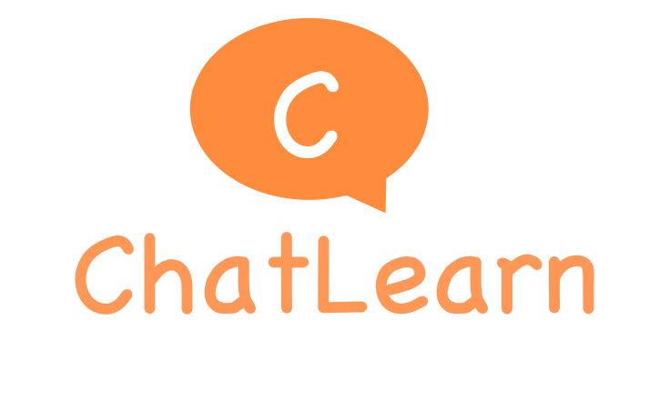

  <picture>
    
  </picture>

<h3 align="center">
A flexible and efficient training framework for large-scale RLHF
</h3>

        &nbspEnglish&nbsp |  <a href="README_CN.md"> 中文 </a>&nbsp

---

*Latest News* 🔥
- [2023/08] We officially released ChatLearn! Check out our [documentation](docs/en/chatlearn.md)。

---

ChatLearn is a flexible and efficient training framework for large-scale RLHF. Chatlearn has the following advantages:
1. **User-friendly programming interface**: Users can focus on programming individual models by wrapping a few functions, while the system takes care of resource scheduling, data and control flow transmission, and distributed execution.
2. **Multiple distributed acceleration backends**: Users can use different computation backends for model development, such as Megatron-LM and DeepSpeed.
3. **Hybrid parallel strategies**: Various parallel strategies can be employed, including Data Parallel, Tensor Parallel, Sequence Parallel, Pipeline Parallel, ZeRO, and the combination thereof.
4. **Flexible resource allocation**: ChatLearn supports a flexible resource scheduling mechanism, allowing for exclusive or shared resource allocation among different models. It utilizes system scheduling strategies to enable efficient sequential or parallel execution.
5. **High performance**: Compared to the current state-of-the-art systems, ChatLearn achieves a 51%-77% improvement in performance from 7B to 30B scales. Additionally, ChatLearn supports even larger-scale RLHF training, such as 175B Policy + 175B Reward.

By providing a comprehensive and efficient framework, ChatLearn empowers researchers and practitioners to train large-scale RLHF models with ease, scalability, and improved performance.

# Quick Start

Please refer to the [documentation](https://chatlearn.readthedocs.io/en/latest/) for a quick start.

1. [Environment and Code Setup](docs/en/installation.md) 
2. [End-to-End Training Tutorial with LLaMA Model](docs/en/tutorial.md)

# Supported Models

The current ChatLearn framework supports RLHF training for GPT/LLaMA models of any scale.

| Model Type                                                                                                                                                                         |
|:-----------------------------------------------------------------------------------------------------------------------------------------------------------------------------|
| GPT (various scales of GPT models)                                                                                                                                                          |
| LLaMA (`lmsys/vicuna-13b-v1.3`, `decapoda-research/llama-7b-hf`, `decapoda-research/llama-13b-hf`, `decapoda-research/llama-30b-hf`, `decapoda-research/llama-65b-hf`, etc.) |
| LLaMA2 (`meta-llama/Llama-2-7b-hf`, `meta-llama/Llama-2-13b-hf`)                                                                                                             |

Note: The current performance benchmark is based on the GPT series models.

# Performance

We have compared the RLHF training throughput of models with different parameter sizes. We adopt an N+N model configuration, where the Policy model and Reward model have the same parameter size. The tests are performed on A800-80GB GPUs, with a single node configuration of 8 GPU cards and 800Gb RDMA interconnect between nodes. We have compared ChatLearn with DeepSpeed-Chat for model configurations ranging from 7B to 66B, with LoRA disabled/enabled. ChatLearn achieves a speedup of 51% to 77% across different scales. In larger scales, under the configuration of 30B+30B with 32 GPUs, DeepSpeed-Chat encounters OOM errors without LoRA enabled. Under the configuration of 66B+66B with 32 GPUs, DeepSpeed-Chat encounters OOM errors regardless of LoRA being enabled or not. ChatLearn, on the other hand, supports training of larger model configurations on the same machine scale. DeepSpeed-Chat encounters a kernel error when seq_len=2048.

In addition, we evaluate the performance under larger scales and different sequence length configurations. 
The following graphs show the RLHF training performance for 66B+66B and 175B+175B.

# Roadmap
ChatLearn will support the following features in the future:
- [ ] Support for more models
- [ ] Integration with DeepSpeed as a training backend
- [ ] Automatic parallel strategy optimization
- [ ] Support for efficient inference engines like vLLM
- [ ] Support for more RL algorithms

  
We welcome community partners to collaborate and contribute to the development.

