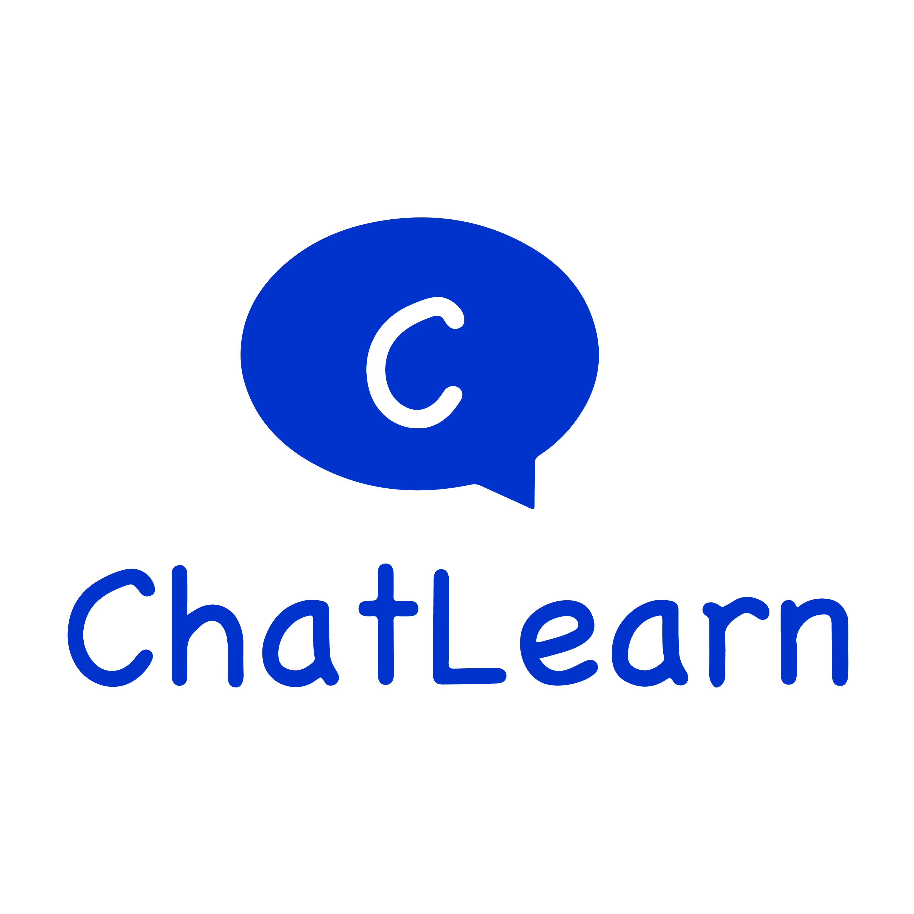
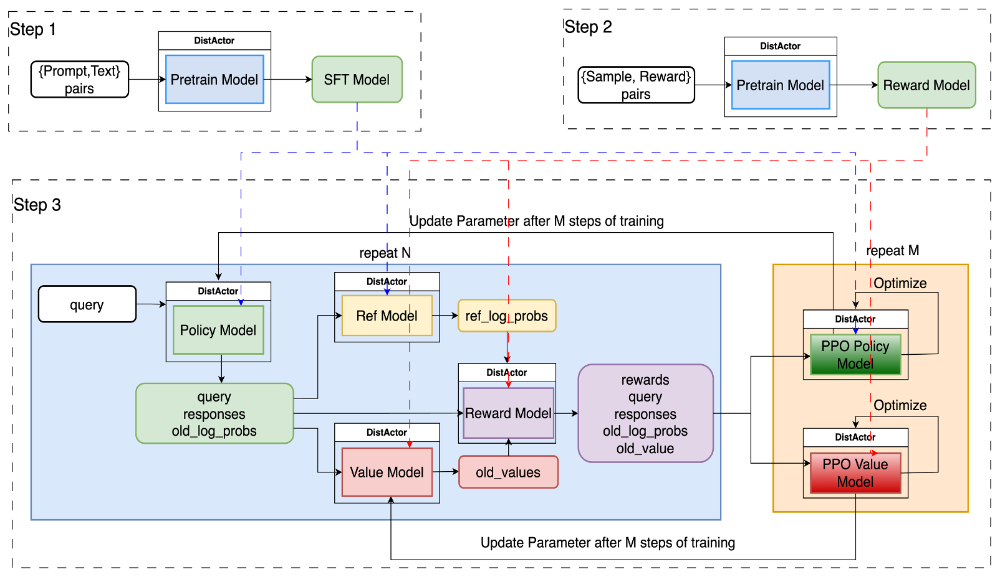
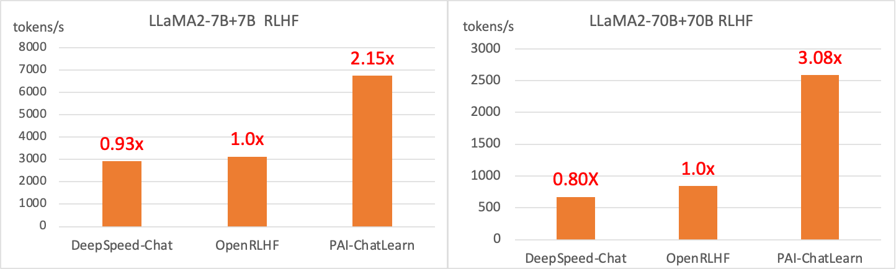

  <picture>
    
  </picture>

<h3 align="center">
A flexible and efficient reinforcement learning framework for large language models(LLMs).  
</h3>

  
  

        &nbspEnglish&nbsp |  <a href="README_CN.md"> 中文 </a>&nbsp

---

*Latest News* 🔥
- [2025/8] We support GSPO on [Mcore](scripts/train_mcore_vllm_qwen3_30b_gspo.sh)! 🔥
- [2025/7] We give a reinforcement learning training example for DeepSeek-V3-671B based on [Mcore](scripts/train_mcore_vllm_deepseek_v3_671b_grpo.sh)! 🔥
- [2025/7] We give reinforcement learning training examples for Qwen3-235B-A22B based on [Mcore](scripts/train_mcore_vllm_qwen3_235b_grpo.sh) and [FSDP2](scripts/train_fsdp_vllm_qwen3_235b_a22b_grpo.sh)! 🔥
- [2025/7] Training now supports the FSDP2 framework! We support sequence packing, sequence parallelism, and group GEMM for efficient and user-friendly reinforcement learning training! 🔥
- [2025/5] We support Mcore frameworks for training! By using Mcore and vLLM, we give a [tutorial](docs/en/tutorial/tutorial_grpo_mcore.md) about end-2-end GRPO training for Qwen3!
- [2025/5] We support FSDP frameworks for training! By using FSDP and vLLM, we give a [tutorial](docs/en/tutorial/tutorial_grpo_fsdp.md) about end-2-end GRPO training for Qwen3!
- [2024/8] We officially released ChatLearn! Check out our [documentation](docs/en/chatlearn.md).

---

ChatLearn is a large-scale reinforcement learning training framework for LLMs developed by the Alibaba Cloud PAI platform.

Chatlearn has the following advantages:
1. 🚀**User-friendly programming interface**: Users can focus on programming individual models by wrapping a few functions, while the system takes care of resource scheduling, data and control flow transmission, and distributed execution.
2. 🔧**Highly Scalable Training Methodology**: ChatLearn supports user-defined model execution flows, making customized training processes more flexible and convenient.
3. 🔄**Diverse Distributed Acceleration Engines**: ChatLearn supports industry-leading SOTA training (FSDP2, Megatron) and inference engines (vLLM, SGLang), delivering exceptional training throughput performance.
4. 🎯**Flexible Parallel Strategies and Resource Allocation**: ChatLearn supports different parallel strategies for various model configurations, enabling the formulation of distinct parallel approaches tailored to each model's computational, memory, and communication characteristics. Additionally, ChatLearn features a flexible resource scheduling mechanism that accommodates exclusive or shared use of resources across models. Through its system scheduling policies, it facilitates efficient serial/parallel execution and optimized GPU memory sharing, enhancing overall performance and efficiency.
5. ⚡**High performance**: Compared to current SOTA systems, ChatLearn achieves a 52% performance improvement at the 7B+7B (Policy+Reward) scale and a 137% performance improvement at the 70B+70B scale. Meanwhile, ChatLearn supports reinforcement learning training at scales exceeding 600B parameters.

# Quick Start

Please refer to the [documentation](https://chatlearn.readthedocs.io/zh-cn/latest/) for a quick start.

1. [Environment and Code Setup](docs/en/installation.md)  
2. [End-to-End GRPO Training Pipeline for Qwen3 Model Using FSDP + vLLM](docs/en/tutorial/tutorial_grpo_fsdp.md)  
3. [End-to-End GRPO Training Pipeline for Qwen3 Model Using Megatron + vLLM](docs/en/tutorial/tutorial_grpo_mcore.md)

## Feature List

- Supports training engines such as [Megatron](https://github.com/alibaba/ChatLearn/blob/main/scripts/train_mcore_vllm_qwen3_8b_grpo.sh) and [FSDP](https://github.com/alibaba/ChatLearn/blob/main/scripts/train_fsdp_vllm_qwen3_8b_grpo.sh)
- Supports inference engines including vLLM and SGLang, controlled via the `runtime_args.rollout_engine` parameter
- Supports reinforcement learning algorithms such as GRPO and [GSPO](https://github.com/alibaba/ChatLearn/blob/main/scripts/train_mcore_vllm_qwen3_30b_gspo.sh)
- Supports experiment monitoring with wandb and tensorboard
- Supports training acceleration techniques such as [sequence packing](https://github.com/alibaba/ChatLearn/blob/main/scripts/train_fsdp_vllm_qwen3_8b_grpo.sh), Ulysses sequence parallelism, and [Group GEMM](https://github.com/alibaba/ChatLearn/blob/main/scripts/train_fsdp_vllm_qwen3_30b_a3b_grpo.sh)

# Performance

We compared the RLHF training throughput of models with different parameter scales, adopting an N+N model configuration where both the Policy model and the Reward model have the same number of parameters. We benchmarked against DeepSpeed-Chat and OpenRLHF with 7B and 70B model configurations. For the 8 GPU setup with a 7B+7B scale, we achieved a 115% speedup; for the 32 GPU setup with a 70B+70B scale, the speedup was 208%. The larger the scale, the more pronounced the acceleration effect becomes. Additionally, ChatLearn can support even larger-scale reinforcement learning, such as at a 600B scale.

Note: The performance of DeepSpeed-Chat and OpenRLHF has already been optimized.

# Roadmap

The upcoming features for ChatLearn include:
- [x] Simplify Configuration Settings
- [x] Support tutorials for the RL training of MoE (Mixture of Experts) models
- [ ] Support for more models
- [ ] Performance Optimization
- [ ] Support for more RL algorithms

We are continuously hiring and welcome you to contact us or submit your resume to [email](mailto:huangjun.hj@alibaba-inc.com).