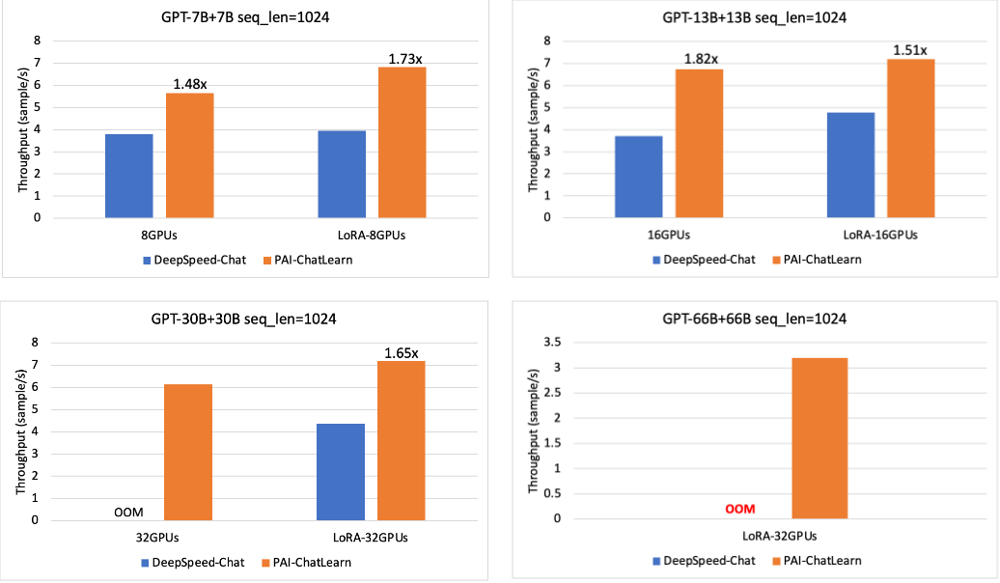
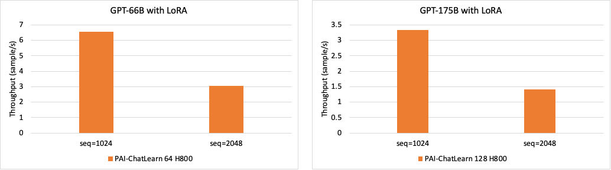

  <picture>
    
  </picture>

<h3 align="center">
灵活易用、大规模 RLHF 高效训练框架
</h3>

        <a href="README.md">English</a>&nbsp |  &nbsp中文&nbsp

---

*最新进展* 🔥
- [2023/10] 正式开源 ChatLearn，更多介绍请参考我们的 [文档](docs/zh/chatlearn.md)。

---

ChatLearn 是一个灵活易用、大规模 RLHF 高效训练框架。ChatLearn 通过对模型计算逻辑的抽象，解耦了模型和计算 backend、分布式策略的绑定，提供灵活的资源调度机制，可以支持灵活的资源分配和并行调度策略。

ChatLearn的特点如下:
1. **易用的编程接口**: ChatLearn提供通用的编程抽象，用户只需要封装几个函数即可完成模型构造。用户只需要专注于单模型的编程，系统负责资源调度、数据流传输、控制流传输、分布式执行等。
2. **多种分布式加速引擎**: 用户可以使用不同的计算 backend 进行模型建模，如 Megatron-LM、DeepSpeed 等。
3. **Hybrid 并行策略**: ChatLearn 支持各种并行策略组合：Data Parallel/Tensor Parallel/Sequence Parallel/Pipeline Parallel/ZeRO 及其组合。
4. **灵活的资源分配**: ChatLearn 支持灵活的资源调度机制，支持各模型的资源独占或复用，通过系统调度策略支持高效的串行/并行执行。
5. **高性能**: 相较于当前的 SOTA 系统，ChatLearn 在 7B 到 30 B 规模提升 48%-82%。同时，ChatLearn 支持更大规模的 RLHF 训练 (175B Policy + 175B Reward)。

# 快速开始

请参考 [文档](https://chatlearn.readthedocs.io/zh/latest/) 快速开始.

1. [环境和代码准备](docs/zh/installation.md)
2. [基于 LLaMA/LLaMA2 模型的端到端训练教程](docs/zh/tutorial/tutorial_llama2.md)
3. [基于 BLOOM 模型的端到端训练教程](docs/zh/tutorial/tutorial_bloom.md)

# 支持的模型

当前 ChatLearn 框架支持任意规模的 GPT/LLaMA 模型 RLHF 训练。

| 模型类型                                                                                                                                                                         |
|:-----------------------------------------------------------------------------------------------------------------------------------------------------------------------------|
| GPT (GPT 系列各种规模的模型)                                                                                                                                                          |
| LLaMA (`lmsys/vicuna-13b-v1.3`, `decapoda-research/llama-7b-hf`, `decapoda-research/llama-13b-hf`, `decapoda-research/llama-30b-hf`, `decapoda-research/llama-65b-hf`, etc.) |
| LLaMA2 (`meta-llama/Llama-2-7b-hf`, `meta-llama/Llama-2-13b-hf`, `meta-llama/Llama-2-70b-hf`)                                                                                |
| Baichuan (`baichuan-inc/Baichuan-7B`, `baichuan-inc/Baichuan-13B-Base`)                                                                                                      |
| BLOOM (`bigscience/bloom-1b1`, `bigscience/bloom-7b1`, `bigscience/bloom`)                                                                                                   |

注：当前的性能 benchmark 均基于 GPT 系列模型。

# 性能评估

我们比较了不同参数量规模模型的 RLHF 训练吞吐量，我们采取 N+N 的模型配置，即 Policy 模型和 Reward 模型采用相同大小的参数量。测试基于 A800-80GB GPU 进行，单节点配置 8 卡 GPU，节点间采用 800Gb RDMA 互联。我们和 DeepSpeed-Chat 对比了从 7B 到 66B 的模型配置，关闭/开启 LoRA 后的性能对比，ChatLearn 在不同规模有 48% 到 82% 的加速，在更大的规模下，在 30B+30B，32GPUs 的配置下，不开启 LoRA 的情况下，DeepSpeed-chat 出现 OOM，在 66B+66B，32GPUs 的配置下，DeepSpeed-Chat 无论是否开启 LoRA 均会出现 OOM，ChatLearn 在相同机器规模下，可以支持更大的模型配置训练。在 seq_len=2048 时，DeepSpeed-Chat 出现了 kernel error。

同时，我们评估了在更大规模以及不同 sequence length 配置下的性能。下图分别为 66B+66B，175B+175B 的 RLHF 训练性能。

# Roadmap

ChatLearn 接下来会支持以下特性：
- [ ] 支持更多的模型；
- [ ] 接入 DeepSpeed 作为训练 backend；
- [ ] 自动并行策略调优；
- [ ] 支持 vLLM 等高效推理引擎；
- [ ] 支持更多的 RL 算法；

  
我们欢迎社区小伙伴参与进来合作开发。

