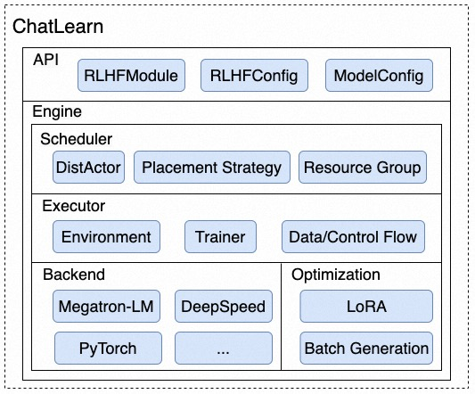
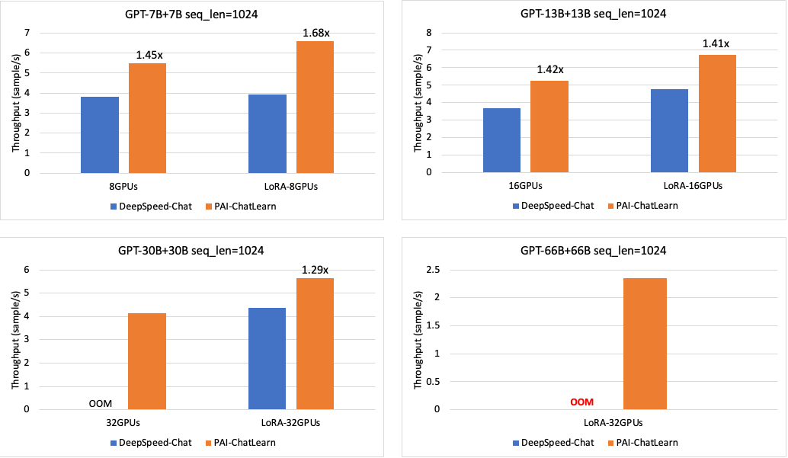
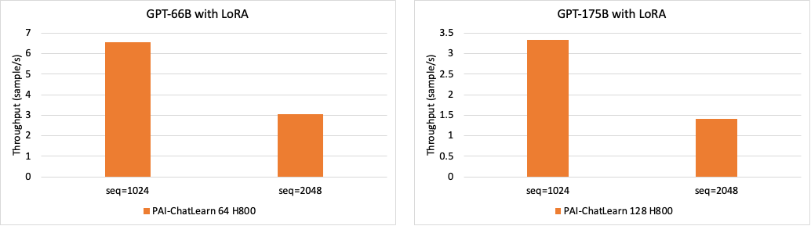

# ChatLearn

ChatLearn is an efficient training framework that supports large-scale Reinforcement Learning from Human Feedback (RLHF). It aims to provide a flexible and user-friendly platform for training models based on Large Language Models (LLMs) such as ChatGPT.

# Introduction

ChatGPT, developed by OpenAI, is a chatbot model based on a large language model (LLM) that has gained popularity and widespread adoption for its impressive conversational capabilities. The success of ChatGPT can be attributed to the new training paradigm called Reinforcement Learning from Human Feedback (RLHF). RLHF optimizes language models based on human feedback using reinforcement learning techniques.

Unlike traditional deep learning training, which involves iterations and optimization of a single model, RLHF and similar training paradigms necessitate the computation and data interaction of multiple large models. This poses numerous challenges in building a user-friendly and efficient training system.

1. **Programming Interface**: How to design a universal and flexible programming interface that allows users to focus on the modeling of individual models while also providing flexible control over the interaction between models.
2. **Distributed Acceleration backends**: As the scale of models increases, users often resort to distributed computing and acceleration backends such as Megatron-LM and DeepSpeed to improve performance. Integrating these acceleration backends into a multi-model computation framework requires careful consideration and design.
3. **Parallel Strategies**: Different models may possess distinct computational characteristics. For instance, models solely used for inference and those intended for training exhibit variations in terms of memory usage and computational requirements. Additionally, the most suitable parallel strategy may differ for each model. Consequently, a framework should enable the configuration of different parallel strategies for different models to maximize overall performance.
4. **Resource Allocation**: How to flexibly allocate resources to multiple models to achieve efficient concurrent scheduling and execution.

To address these challenges, we propose a novel RLHF model training framework called ChatLearn. ChatLearn abstracts the computation logic of models, decoupling the models from the computation backend and parallel strategies. It provides a flexible resource scheduling mechanism that supports flexible resource allocation and parallel scheduling strategies. Chatlearn has the following advantages:

1. **User-friendly programming interface**: Users can focus on programming individual models by wrapping a few functions, while the system takes care of resource scheduling, data and control flow transmission, and distributed execution.
2. **Multiple distributed acceleration backends**: Users can use different computation backends for model development, such as Megatron-LM and DeepSpeed.
3. **Hybrid parallel strategies**: Various parallel strategies can be employed, including Data Parallel, Tensor Parallel, Sequence Parallel, Pipeline Parallel, ZeRO, and the combination thereof.
4. **Flexible resource allocation**: ChatLearn supports a flexible resource scheduling mechanism, allowing for exclusive or shared resource allocation among different models. It utilizes system scheduling strategies to enable efficient sequential or parallel execution.
5. **High performance**: Compared to the current state-of-the-art systems, ChatLearn achieves a 29%-68% improvement in performance from 7B to 30B scales. Additionally, ChatLearn supports even larger-scale RLHF training, such as 175B Policy + 175B Reward.

By providing a comprehensive and efficient framework, ChatLearn empowers researchers and practitioners to train large-scale RLHF models with ease, scalability, and improved performance.

# Technical Architecture

**API:** To support various computation backends such as Megatron-LM and DeepSpeed, ChatLearn provides a universal programming interface called `RLHFModule`. By inheriting from `RLHFModule` and implementing basic computational functions like `forward_step` and `train_step`, users can encapsulate different computation backends. Additionally, ChatLearn utilizes YAML files to configure RLHF training, including different model settings, hyperparameters, and parallel strategies, enabling flexible model and parallel strategy configurations.

**Scheduler:** As the training scale of large language models increases (e.g., models with a scale of 175B), a single machine is no longer sufficient to accommodate such large-scale training. Distributed computing across multiple machines becomes necessary. ChatLearn introduces the abstraction of `DistActor` to represent distributed models. `DistActor` is built on top of Ray actor, providing state management and isolation between workers. It seamlessly manages parameters and states of different models. Moreover, `DistActor` addresses the limitation of Ray actors being unable to span across machines, enabling support for distributed models. With `DistActor`, ChatLearn supports inference and training for models of any scale. 
Additionally, the ChatLearn Scheduler achieves hardware-aware affinity scheduling by partitioning the cluster's resource groups and employing scheduling strategies. This means that the system prioritizes scheduling the same distributed model on the GPUs of the same node.
ChatLearn also supports flexible resource allocation, allowing for resource sharing or resource exclusivity among models, maximizing training efficiency with a given number of resources.

**Executor:** ChatLearn Executor divides the RLHF training process into two main modules: `Environment` and `Trainer`. The `Environment` module handles the concurrent execution and management of model inference and data, while the `Trainer` module handles the corresponding training components. These two modules are responsible for managing the data flow and control flow of the model. Data transfer between models is facilitated through Ray's object store, while parameter transfer between models is performed using NCCL Collective OP.

**Backend:** Thanks to the well-designed programming interface abstractions of ChatLearn, users can easily integrate various distributed acceleration backends through simple encapsulation, such as Megatron-LM and DeepSpeed.

**Optimization**: ChatLearn also supports memory optimization and computational acceleration techniques. For example, by developing LoRA, ChatLearn significantly reduces the memory overhead of optimizer states, allowing for larger batch sizes and improving overall computational efficiency. ChatLearn also continuously optimizes the batch generation process for the Policy model, reducing unnecessary calculations due to padding through input sequence sorting, thereby enhancing overall performance.

# Quick Start

Please refer to the [Documentation](https://chatlearn.readthedocs.io/zh/latest/) for a quick start guide.

1. [Environment and Code Setup](installation.md)
2. [End-to-End Training Tutorial with LLaMA Model](tutorial.md)

# Supported Models

The ChatLearn framework currently supports RLHF training for GPT/LLaMA models of any scale.

| Model Type                                                                                                                                                                  |
|:-----------------------------------------------------------------------------------------------------------------------------------------------------------------------------|
| GPT (Various scales of GPT models)                                                                                                                                                        |
| LLaMA (`lmsys/vicuna-13b-v1.3`, `decapoda-research/llama-7b-hf`, `decapoda-research/llama-13b-hf`, `decapoda-research/llama-30b-hf`, `decapoda-research/llama-65b-hf`, etc.) |
| LLaMA2 (`meta-llama/Llama-2-7b-hf`, `meta-llama/Llama-2-13b-hf`)                                                                                                             |

Note: The current performance benchmarks are based on GPT series models.

# Performance

We compared the RLHF training throughput of models with different parameter sizes. We used an N+N model configuration, where the Policy and Reward models have the same parameter size. The tests were conducted on A800-80GB GPUs, with a single node configuration of 8 GPUs and 800Gb RDMA interconnects between nodes. We compared the performance of ChatLearn with and without LoRA against DeepSpeed-Chat for models ranging from 7B to 66B. ChatLearn achieved a 29% to 68% speedup at different scales. At larger scales, with a 30B+30B, 32-GPU configuration, DeepSpeed-Chat experienced OOM errors when LoRA was disabled. With a 66B+66B, 32-GPU configuration, DeepSpeed-Chat experienced OOM errors regardless of whether LoRA was enabled or not. ChatLearn, on the other hand, was able to support training with larger model configurations on the same machine scale. Additionally, DeepSpeed-Chat encountered a kernel error when seq_len was set to 2048.

Furthermore, we evaluated the performance of RLHF training for models at larger scales and different sequence lengths. The following graphs show the performance for 66B+66B and 175B+175B RLHF training.

# Roadmap

The upcoming features for ChatLearn include:
- [ ] Support for more models
- [ ] Integration with DeepSpeed as a training backend
- [ ] Automatic parallel strategy tuning
- [ ] Support for efficient inference engines like vLLM
- [ ] Support for more RL algorithms

  

We welcome community members to collaborate and contribute to the development of ChatLearn.

# Reference

1. Megatron-LM: https://github.com/NVIDIA/Megatron-LM
2. DeepSpeed-Chat: https://github.com/microsoft/DeepSpeedExamples/tree/master/applications/DeepSpeed-Chat
