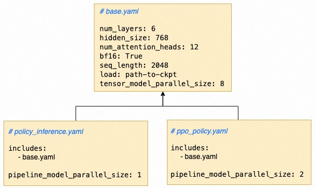

# Configuration Files
## Training Configuration File

Users need a main YAML configuration file to set up the runtime environment, model configurations, and RLHF training process-related configurations. Additionally, users may need separate model configurations for each model.

The RLHF training configuration consists of three parts:

1. `runtime_env`: Configuration for the runtime environment.
2. `models`: Model configurations. Each model can have its own specific parameter configuration. Different models can be distinguished by using `model_name`, which corresponds to the `model_name` passed in when defining the model in the main file.
3. `rlhf`: RLHF training configuration.

Below is an example of a training configuration. For detailed explanations of the configuration options, please refer to the [Config API Documentation](api/config.rst).

To facilitate the configuration of different hyperparameters, we also support reading parameters from environment variables. The format is as follows:

```
param: ${env_name:default_value}
```

`param` is the parameter name, `env_name` is the environment variable name, and `default_value` is the default value (optional). 

In the following example, if the environment variable `ref_generation_batch_size` is set, the value will be read from the environment variable and assigned to `reference`'s `generation_batch_size`. If the environment variable `ref_generation_batch_size` is not set, the default value of 4 will be used.


```yaml
runtime_env:
  platform: DLC
  excludes:
    - "*pt"
    - "logs"
    - "tensorboards"
    - ".nfs*"


models:
  policy:
    model_config_file: policy_inference.yaml
    num_gpu: 8
    trainable: False

  reference:
    model_config_file: reference.yaml
    num_gpu: 8
    trainable: False
    generation_batch_size: ${ref_generation_batch_size:4}

  reward:
    model_config_file: reward_inference.yaml
    num_gpu: 8
    trainable: False

  value:
    model_config_file: old_value_inference.yaml
    num_gpu: 8
    trainable: False

  ppo_policy:
    model_config_file: ppo_policy.yaml
    num_gpu: 8
    trainable: True

  ppo_value:
    model_config_file: ppo_value.yaml
    num_gpu: ${num_gpu:16}
    trainable: True

runtime:
  colocation:
    - policy,ppo_policy,reward,reference,value,ppo_value
  generation_batch_size: ${generation_batch_size:4}
  train_micro_batch_size: 2
  train_global_batch_size: ${train_global_batch_size:512}
  num_episode: 200
  sample_per_episode: ${sample_per_episode:1024}
  num_training_epoch: 1
  save_episode_interval: ${save_episode_interval:50}
  data_path: ${data_path}
  eval_episode_interval: ${eval_episode_interval:100}
```


## Model Configuration YAML

This framework supports separate configuration files for each model, which can be used to configure hyperparameters, parallelization strategies, checkpoint initialization, and more for different models. The model configuration file is in YAML format. Here is a simple example of a model configuration:

```yaml
num_layers: 6
hidden_size: 768
num_attention_heads: 12
bf16: True
seq_length: 2048
tensor_model_parallel_size: 8
pipeline_model_parallel_size: 2
load: path-to-ckpt
```

To simplify the sharing of configuration across different models, we have extended the syntax of YAML by introducing the `include` field to inherit configurations from a base configuration file. In the example below, `policy_inference.yaml` and `ppo_policy.yaml` share parameters such as `num_layers` and `hidden_size`, while each model has its own specific `pipeline_model_parallel_size` configuration.


