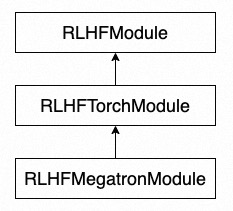

# Programming Interface

This section will introduce the programming interface of ChatLearn. We will start with the main file and explain how to construct the `RLHFEngine`. Then, we will discuss how to write models.


## Main Training File

The following is an example of a user's main training file:

1. Call `chatlearn.init()` to initialize the runtime environment for RLHF.
2. Define the models required for training. Each model needs to have a unique `model_name`. Different models are distinguished by their `model_name` when configuring the model parameters. Please refer to the [training configuration](config_yaml) for more details.
3. Define the engine [RLHFEngine](api/engine.rst).
4. Set up the training dataset.
5. Call `engine.learn` to start the RLHF training.

```python
from models import PolicyInference
from models import PolicyReference
from models import PolicyTrainer
from models import RewardInference
from models import ValueInference
from models import ValueTrainer

import chatlearn
from chatlearn import RLHFEngine

# init
chatlearn.init()

# define models
policy_model = PolicyInference("policy")
reference_model = PolicyReference("reference")
reward_model = RewardInference("reward")
value_model = ValueInference("value")
ppo_policy_model = PolicyTrainer("ppo_policy")
ppo_value_model = ValueTrainer("ppo_value")

# define engine
engine = RLHFEngine(policy_model,
                    reference_model,
                    reward_model,
                    value_model,
                    ppo_policy_model,
                    ppo_value_model)

# set dataset
train_prompts = ["test"] * 4096
engine.set_dataset(train_prompts)

# start rlhf training
engine.learn()
```


## Model Definition



User-defined models need to inherit from `RLHFModule` or its subclasses. `RLHFTorchModule` is the wrapper for general Torch models, and `RLHFMegatronModule` is the wrapper for Megatron models. If the user's RLHF modeling is based on Megatron-LM, they can directly inherit from `RLHFMegatronModule` to complete the model construction.

Here are examples of model construction for both the inference and training models, using inheritance from `RLHFMegatronModule`:
1. For the inference model, users need to implement the `setup` and `forward_step` methods. In `setup`, define the model, initialize parameters, and define global parameters. In `forward_step`, implement the logic required for one forward pass of the model.
2. For the training model, users need to implement the `setup` and `train_step` methods. In `train_step`, implement the logic required for one training step.
3. In addition, the `PolicyInference` model needs to implement the `build_dataset` method to construct the prompt dataset.

For more API information, refer to [RLHF Module API](api/module.rst).

```python
from chatlearn import RLHFMegatronModule

class PolicyInference(RLHFMegatronModule):

    def __init__(self, name):
        """
        Args:
            name: model name
        """


    def setup(self):
        """
        1. define model, self.model = xxx
        2. init global variables, etc.
        3. for training model, define optimizer, self.optimizer = xxx
        4. init model parameters
        """
        pass
    

    def forward_step(self, data, iteration=0):
        """
        Perform forward step for one batch
        Args:
            data: one batch for forward_step, type is dict
            iteration: iteration id for current step
        Returns:
            k/v dict
        """
        pass


    def build_dataset(self, train_prompts):
        """
        Build prompt dataset. The implementation of build_dataset is exclusive to PolicyInference, whereas other models are not required to adopt it.

        Args:
            train_prompts: prompts provided by RLHFEngine.set_dataset(train_prompts)
        Returns:
            torch.utils.data.Dataset with user-defined collate_fn (see `Dataset`)
        """
        pass
```

```python
from chatlearn import RLHFMegatronModule

class PolicyTrainer(RLHFMegatronModule):


    def setup(self):
        """
        1. define model, self.model = xxx
        2. init global variables, etc.
        3. for training model, define optimizer, self.optimizer = xxx
        4. init model parameters
        """
        pass


    def train_step(self, data, train_info):
        """
        Perform train_step for one batch, including a list of micro-batches
        Args:
            data: one global batch for train_step, type is a list of dict, each dict is a micro-batch
            train_info: includes training information, e.g., "iteration"
        """
        pass
```
## Dataset

To utilize a user-defined dataset in the ChatLearn framework, users need to inherit from `torch.utils.data.Dataset` and specify the `collate_fn` method. Inheriting from `torch.utils.data.Dataset` requires users to override the `__init__`, `__getitem__`, and `__len__` methods according to their specific requirements, as explained in the PyTorch tutorial on creating custom datasets see [Creating a Custom Dataset for Your Files](https://pytorch.org/tutorials/beginner/basics/data_tutorial.html#creating-a-custom-dataset-for-your-files). The `collate_fn` method allows users to customize the data collation process, as documented in the [collate_fn API](https://pytorch.org/docs/stable/data.html#dataloader-collate-fn). If users do not require custom data collation, they can set `self.collate_fn = None` in the `__init__` method.

Here is an example that demonstrates how to inherit from torch.utils.data.Dataset and specify the collate_fn method:

```bash
class PromptDataset(Dataset):
    """
    A custom dataset to construct batched prompts.
    """
    def __init__(self, data):
        self.data = data

    def __len__(self):
        return len(self.data)

    def __getitem__(self, idx):
        return {"query": self.data[idx]}

    def collate_fn(self, samples):
        batched_data = {}
        for sample_key, sample_value in samples.items():
            batched_data[sample_key] = torch.stack(sample_value)
        return batched_data
```
