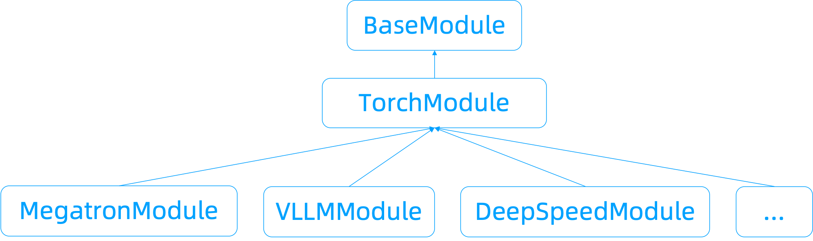
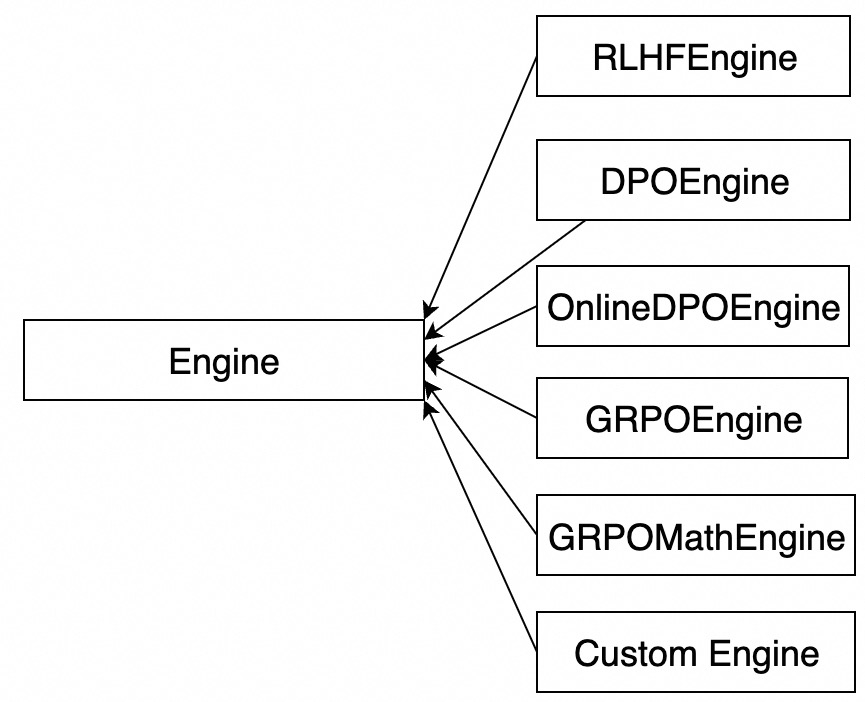

# Programming Interface
This chapter will introduce the programming interface of ChatLearn.

## Training Main File
The following is an example of the user's training main file.

```python
from examples.megatron.models import PolicyInference
from examples.megatron.models import PolicyReference
from examples.megatron.models import PolicyTrainer
from examples.megatron.models import RewardInference
from examples.megatron.models import ValueInference
from examples.megatron.models import ValueTrainer
import chatlearn
from chatlearn import RLHFEngine
# init
chatlearn.init()
# define models
policy_model = PolicyInference("policy")
reference_model = PolicyReference("reference")
reward_model = RewardInference("reward")
value_model = ValueInference("value")
ppo_policy_model = PolicyTrainer("ppo_policy")
ppo_value_model = ValueTrainer("ppo_value")
# define engine
engine = RLHFEngine(policy_model,
                    reference_model,
                    reward_model,
                    value_model,
                    ppo_policy_model,
                    ppo_value_model)
# set dataset
train_prompts = ["test"] * 4096
engine.set_dataset(train_prompts)
# start rlhf training
engine.learn()
```

1. Call `chatlearn.init()` to initialize the runtime environment of ChatLearn.
2. Define models, where each model needs to define a unique `model_name`. Different model configurations are distinguished by `model_name`. See [training configuration file](config_yaml.md) for details.
3. Define the engine [RLHFEngine](api/engine.rst).
4. Define evaluator (optional)
4. Set the training dataset.
5. Call `engine.learn` to start the training for alignment. 

For a complete example, please refer to [train_rlhf_llama.sh](https://github.com/alibaba/ChatLearn/blob/main/examples/megatron/scripts/train_rlhf_llama.sh)

## Define Model



The user's model needs to inherit `BaseModule` or its subclasses. `TorchModule` is a general encapsulation of Torch models, `MegatronModule` is an encapsulation of Megatron models, `DeepSpeedModule` is an encapsulation of DeepSpeed models, `VLLMModule` is an encapsulation of vLLM models. The following two code snippets show examples of model construction for inference and training:
1. For inference models, users need to implement the `setup` and `forward_step` methods. In `setup`, implement model definition, parameter initialization, global parameter definition, etc. In `forward_step`, implement the logic required for one forward step of the model.
2. For training models, users need to implement the `setup` and `train_step` methods. In `train_step`, implement the logic required for training a step.
3. In addition, the first model of the engine needs to implement the `build_dataset` method to construct the prompt dataset.

Refer to [Module API](api/module.rst) for more API information.

```python
from chatlearn import VLLMModule

class PolicyInference(VLLMModule):
    def __init__(self, name):
        """
        Args:
            name: model name
        """
    def setup(self):
        """
        1. define model, self.model = xxx
        2. init global variables, etc.
        3. for training model, define optimizer, self.optimizer = xxx
        4. init model parameters
        """
        pass

    def forward_step(self, data, iteration=0):
        """
        Perform forward step for one batch
        Args:
            data: one batch for forward_step, type is dict
            iteration: iteration id for current step
        Returns:
            k/v dict
        """
        pass

    def build_dataset(self, train_prompts, is_eval=False):
        """
        Build prompt dataset. The implementation of build_dataset is exclusive to PolicyInference, whereas other models are not required to adopt it.
        Args:
            train_prompts: prompts provided by RLHFEngine.set_dataset(train_prompts)
            is_eval: eval mode
        Returns:
            torch.utils.data.Dataset with user-defined collate_fn (see `Dataset`)
        """
        pass
```

```python
from chatlearn import MegatronModule

class PolicyTrainer(MegatronModule):
    def setup(self):
        """
        1. define model, self.model = xxx
        2. init global variables, etc.
        3. for training model, define optimizer, self.optimizer = xxx
        4. init model parameters
        """
        pass
    def train_step(self, data, iteration):
        """
        Perform train_step for one batch, including a list of micro-batches
        Args:
            data: one global batch for train_step, type is a list of dict, each dict is a micro-batch
            iteration: iteration id for current step
        """
        pass
```

## Define Engine



ChatLearn provides a series of built-in Engine types that users can directly use to construct training. Additionally, users can also construct custom engines to customize the model flow, as described in [Custom Model Flow](tutorial/custom_model_flow.md).

## Define Evaluator
The use of an evaluator can be found in [Constructing Evaluator](tutorial/evaluator.md).

## Dataset
The Dataset used by the user needs to inherit `torch.utils.data.Dataset` and specify the `collate_fn` method. To inherit `torch.utils.data.Dataset`, users need to override the `__init__`, `__getitem__`, and `__len__` methods as per the requirements (see [Creating a Custom Dataset for Your Files](https://pytorch.org/tutorials/beginner/basics/data_tutorial.html#creating-a-custom-dataset-for-your-files)). The `collate_fn` method allows users to customize data collation (see [collate-fn](https://pytorch.org/docs/stable/data.html#dataloader-collate-fn)). If users do not need to customize data collation, they should set `self.collate_fn = None` in the `__init__` method.

```bash
class PromptDataset(Dataset):
    """
    A custom dataset to construct batched prompts.
    """
    def __init__(self, data):
        self.data = data

    def __len__(self):
        return len(self.data)

    def __getitem__(self, idx):
        return {"query": self.data[idx]}

    def collate_fn(self, samples):
        batched_data = {}
        for sample_key, sample_value in samples.items():
            batched_data[sample_key] = torch.stack(sample_value)
        return batched_data
```
