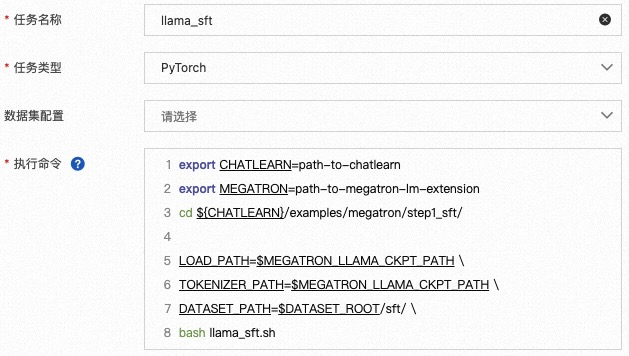
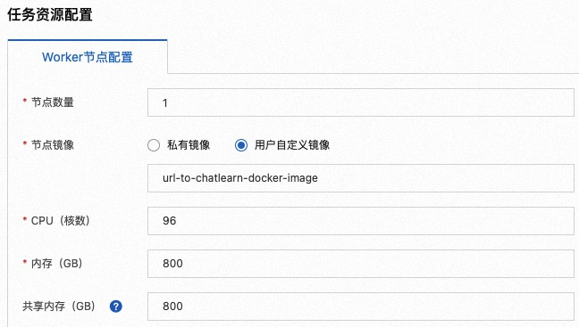
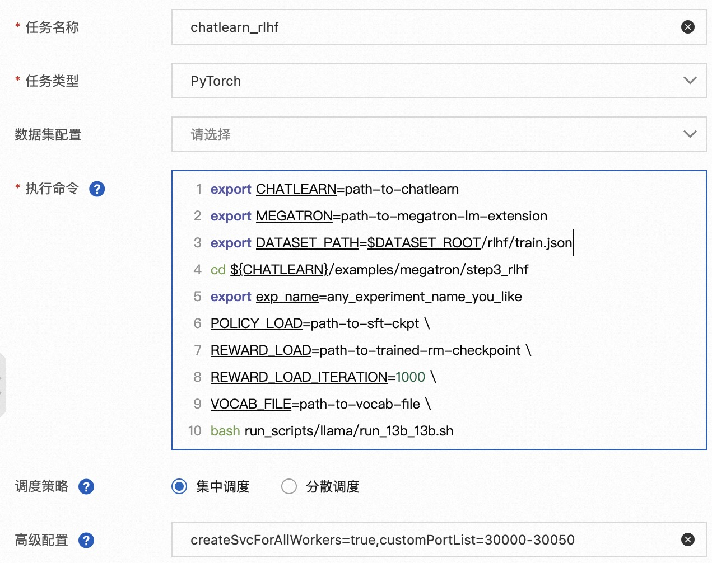
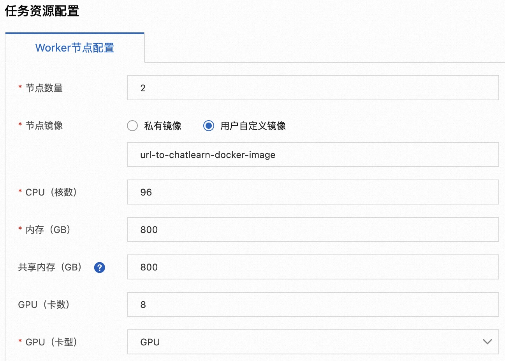

# End-to-end Training Tutorial with LLaMA Model

This document provides instructions for end-to-end training using the ChatLearn, Megatron-LM framework, and the LLaMA model. It includes three stages of training: SFT, Reward, and RLHF training.

# Setup: Image and Code Preparation

## Docker Image
It is recommended to refer to `https://github.com/alibaba/ChatLearn/tree/master/docker/ngc/Dockerfile.ngc22.10` for preparing the docker image.

## Code

In this example, we need to download the following related code.

```bash
# Download the modified Megatron-LM-ChatLearn to support ChatLearn training
git clone https://github.com/alibaba/Megatron-LM-ChatLearn.git
# Download the ChatLearn code
git clone https://github.com/alibaba/ChatLearn.git
```

**The following is a collection of general environment variables used in this tutorial script:**

| ENV | Explanation |
| --- | --- |
| `CHATLEARN` | The location where the ChatLearn code is cloned [https://github.com/alibaba/ChatLearn.git](https://github.com/alibaba/ChatLearn.git) |
| `MEGATRON` | The location where the Megatron-LM-ChatLearn code is cloned [https://github.com/alibaba/Megatron-LM-ChatLearn.git](https://github.com/alibaba/Megatron-LM-ChatLearn.git) |
| `DATASET_ROOT` | The root directory for storing the SFT/Reward/RLHF training dataset collection. |
| `TOKENIZER_PATH` | The folder where the vocab_file used by the Tokenizer is located. |


# Step1: SFT

SFT refers to the process of fine-tuning a pre-trained language model using annotated dialogue data. In this example, we need to prepare the training data, download the pre-trained model, and then start a simple SFT training demonstration.

## 1.1 Prepare Training Data

Organize the question-response pairs of SFT data into a jsonl file, where each line of the jsonl file represents a SFT data sample in the following Python dictionary format:

```json
{'query': question, 'response': reply}
```

Taking the example of Anthropic's helpful&harmless data, use the following code to store it in `$DATASET_ROOT/sft/train.jsonl`.

```bash
cd ${CHATLEARN}/examples/megatron/step1_sft/
DATASET_ROOT=$path_to_dataset_root
python prepare_data.py $DATASET_ROOT
```

## 1.2 Download and Convert Pretrained Models

If using models from HuggingFace transformers, first download the pretraining checkpoint, such as the LLaMA model from the HuggingFace Hub: `decapoda-research/llama-13b-hf`, or pre-saved SFT models locally.
Then, use the following code to convert the HuggingFace transformers model into the Megatron-LM model format. In this example, we will convert the model to `TP (tensor_model_parallel_size)=8，PP (pipeline_model_parallel_size)=1` checkpoint, and the model will be stored in `MEGATRON_LLAMA_CKPT_PATH`.


```bash
MEGATRON=path-to-megatron
cd $MEGATRON

TRANSFORMERS_CKPT_PATH=path-to-transformer-model \
MEGATRON_LLAMA_CKPT_PATH=path-to-megatron-model \
TP=8 \
PP=1 \
bash examples/pai/tools/convert_transformers_to_megatron.sh
```

## 1.3 Start SFT Training

[Aliyun PAI DLC](https://www.aliyun.com/activity/bigdata/pai-dlc)[2] can conveniently and efficiently support training for various tasks. The script below is an example of SFT training. The `DATASET_PATH` is the path to the SFT training set, such as `$DATASET_ROOT/sft/train.jsonl`. In this example, we assume that the tokenizer's path is the same as the model checkpoint's path.

```bash
export CHATLEARN=path-to-chatlearn
export MEGATRON=path-to-megatron-lm-extension
cd ${CHATLEARN}/examples/megatron/step1_sft/

LOAD_PATH=$MEGATRON_LLAMA_CKPT_PATH \
TOKENIZER_PATH=$MEGATRON_LLAMA_CKPT_PATH \
DATASET_PATH=$DATASET_ROOT/sft/ \
bash llama_sft.sh
```

The training logs and the completed models will be stored in `${CHATLEARN}/output/step1_sft` by default. For specific definitions, please refer to the script `${CHATLEARN}/examples/megatron/step1_sft/llama_sft.sh`.

Below are screenshots of the PAI-DLC task creation page. Select the job type as `PyTorch` and paste the modified command into the `Execution Command` window. Training a 13B SFT model requires 8 A100-80GB/A800-80GB/H800-80GB GPU cards. In this case, we assume that the cluster has homogeneous GPU cards and each node has 8 cards. When applying for resources, request 1 node, 8 GPU cards per node, and set the node image to the ChatLearn compiled image.





If you want to submit distributed training in a non-PAI-DLC environment, the following environment variables need to be configured on each node before executing the script:

```bash
export MASTER_ADDR=xxx
export MASTER_PORT=xxx
export WORLD_SIZE=xxx
export GPUS_PER_NODE=8
export RANK=xx
```

# Step2: Reward Model Training

The Reward model refers to the model that serves as a proxy for human evaluation in RLHF. It provides real-time evaluation and scoring of the model's generated question responses. Given a question and model response, the Reward model produces a scalar representing the quality of the model's response.


## 2.1 Prepare Training Data

1. First, prepare question-different response pairs and organize them into a jsonl file. Each line in the jsonl file represents a Reward model training data sample in the following Python dictionary format:

```json
{'query': question, 'response': [reply 1, reply 2, ...], 'score': [score1, score2, ...]}
```

The score value indicates the quality of the corresponding response, with higher scores indicating higher quality and closer to human preference.

2. Taking the example of Anthropic's helpful&harmless data, use the following code to store it in `$DATASET_ROOT/rm/train.jsonl` and `$DATASET_ROOT/rm/dev.jsonl`.

```bash
cd ${CHATLEARN}/examples/megatron/step2_reward/
DATASET_ROOT=path-to-dataset-root
python prepare_data.py $DATASET_ROOT
```

## 2.2 Start Reward Model Training

Based on InstructGPT[1], the Reward model training is initialized with the SFT model checkpoint. The training code is as follows:

```bash
export CHATLEARN=path-to-chatlearn
export MEGATRON=path-to-megatron-lm-extension
cd ${CHATLEARN}/examples/megatron/step2_reward/

LOAD_PATH=path-to-sft-ckpt \
TOKENIZER_PATH=$MEGATRON_LLAMA_CKPT_PATH \
DATASET_PATH=$DATASET_ROOT/rm/ \
bash llama_reward.sh
```

The training logs and trained models will be saved by default in `${CHATLEARN}/output/step2_reward`. The specific definitions can be found in the script `${CHATLEARN}/examples/megatron/step2_reward/llama_reward.sh`.
To submit the job on PAI-DLC, you can refer to the submission method for SFT training.

# Step 3: RLHF Training

RLHF refers to the process of trying different responses on a dataset consisting only of instructions and learning from the reward signals provided by a reward model for each response.
## 3.1 Preparation of Training Data

1. Firstly, prepare a dataset of instructions to be explored and organize it into a JSON file. Each line in the JSON file should represent a prompt in the following format:

```json
{"prompt": prompt}
```

2. Taking Anthropic's helpful & harmless data as an example, use the following code to store the dataset in `$DATASET_ROOT/rlhf/train.jsonl` and `$DATASET_ROOT/rlhf/dev.jsonl`:
```bash
cd ${CHATLEARN}/examples/megatron/step3_rlhf/
DATASET_ROOT=path-to-dataset-root
python prepare_data.py $DATASET_ROOT
```
## 3.2 Start RLHF Training

[Aliyun PAI DLC](https://www.aliyun.com/activity/bigdata/pai-dlc)[2] provides convenient and efficient support for RLHF training tasks. Below is a training script for a LLaMA-13B Policy and a 13B Reward model. In this example, the user needs to set `POLICY_LOAD` to the checkpoint path produced by SFT (Supervised Fine-Tuning). The Policy model and Reference model will be initialized with the SFT checkpoint. `REWARD_LOAD` should be set to the checkpoint path produced by Reward training, and the user can specify the iteration number associated with the loaded checkpoint. The Reward model and Value model will be initialized using the Reward model weights. `VOCAB_FILE` should point to the folder containing the files required by `LlamaTokenizer`.

```bash
export CHATLEARN=path-to-chatlearn
export MEGATRON=path-to-megatron-lm-extension
export DATASET_PATH=$DATASET_ROOT/rlhf/train.jsonl

cd ${CHATLEARN}/examples/megatron/step3_rlhf

export exp_name=any_experiment_name_you_like

POLICY_LOAD=path-to-sft-ckpt \
REWARD_LOAD=path-to-trained-rm-checkpoint \
REWARD_LOAD_ITERATION=1000 \
VOCAB_FILE=path-to-vocab-file \
bash run_scripts/llama/run_13b_13b.sh
```

The following screenshots illustrate the process of creating a task in PAI DLC. Select the job type as `PyTorch` and paste the modified command into the `Execution Command` window. Additionally, provide the following advanced configuration `customPortList=30000-30050,createSvcForAllWorkers=true`.

13B Policy + 13B Reward RLHF training requires resources equivalent to 16 A100-80GB/A800-80GB/H800-80GB GPU cards. Assuming homogeneous GPU cards are available in the cluster, with each node configured with 8 cards, resource allocation should be requested for 2 nodes and 8 GPU cards per node. Set the node image to the compiled ChatLearn image.





## 3.3 Evaluation
Firstly, we can use ChatLearn's model conversion tool to convert the Megatron-LM formatted model to HuggingFace's transformers model format.

```bash
MEGATRON=path-to-megatron-lm-extension
cd $MEGATRON
MEGATRON_CKPT_PATH=ckpt-to-rlhf-policy-ckpt \
VOCAB_FILE=path-to-vocab-file \
TRANSFORMERS_CKPT_PATH=path-to-transformers-ckpt-path \
bash examples/pai/tools/convert_megatron_to_tranformers.sh
```

We evaluated the performance of LLaMA on the HH dataset, both after SFT and RLHF, using the GPT-4 API provided by MT-Bench. The results show that RLHF improves the average performance of the model compared to SFT. There is a significant improvement in the domains of Humanities, Math, Roleplay, STEM, and Writing. The performance gains observed here are due to the use of a Reward model trained on the open-source HH dataset. Customizing the Reward model contributes to achieving better results.

| Model | Coding | Extraction | Humanities | Math | Reasoning | Roleplay | STEM | Writing | Avg |
| --- | --- | --- | --- | --- | --- | --- | --- | --- | --- |
| llama_sft | 1.6 | 2.7 | 4.2 | 1.1 | 2.85 | 3.35 | 4.55 | 2.95 | 2.90 |
| llama_rlhf | **1.75** | **3.45** | **4.75** | **1.55** | **3.5** | **5.85** | **5.0** | **5.0** | **3.85** |

# Reference

1. Training language models to follow instructions with human feedback，[https://arxiv.org/abs/2203.02155](https://arxiv.org/abs/2203.02155)
2. Aliyun Machine Learning PAI-DLC：[https://www.aliyun.com/activity/bigdata/pai-dlc](https://www.aliyun.com/activity/bigdata/pai-dlc)

