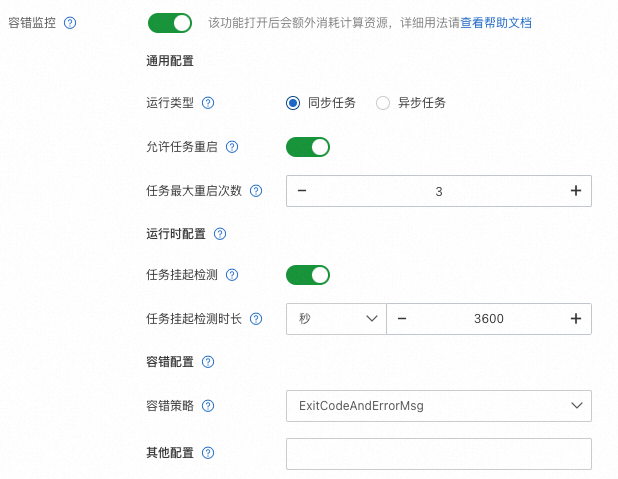

# Resuming and Fault Tolerance

The alignment task involves the computation and interaction of multiple models. As the model scale and computational resources increase, occasional exceptions may occur due to the dependent software stack and hardware environment, leading to task interruption.

To ensure that interrupted tasks can automatically resume their state, ChatLearn provides the resuming function, which in combination with PAI-DLC's AIMaster, can automatically detect errors and resume functionality.

## Configuring ChatLearn Resuming

Resuming an alignment task requires consideration of the following points:

1. Recording and restoring data progress: For recording data status, users need to configure `data_checkpoint_path` in the training configuration master file, such as `rlhf.yaml`. If `data_checkpoint_path` is not empty, ChatLearn will record the current data progress and store the data checkpoint during each `save_checkpoint`.

2. Restoring training states such as episodes and iterations: When users configure `data_checkpoint_path` and the corresponding data checkpoint exists in the folder, ChatLearn will automatically restore the training state to the latest checkpoint status and set the `resume_training` variable to `True`.

3. Loading checkpoints: When `resume_training==True`, the checkpoints for `reference` and `reward` in RLHF remain unchanged. However, `ppo_policy` and `ppo_value` need to load the checkpoints stored during training, rather than the original initialized checkpoints. Therefore, special processing needs to be done in the setup phase.

```python
if self.resume_training:
    self.args.load = get_args().save
    self.args.load_iteration = -1
    self.args.no_load_optim = False
    self.args.no_load_rng = False
    self.args.no_load_args = False
    self.args.no_load_scheduler = False
    self.args.finetune = False
```

For more details, refer to `examples/megatron/scripts/train_rlhf_llama.sh`.

If a user configures `data_checkpoint_path` in the program but does not want to enable the resuming function, they can also disable this functionality by configuring `enable_resume_training: False`.

## Combining with DLC AIMaster to Achieve Fault Tolerance and Automatic Resuming

DLC provides fault tolerance monitoring based on AIMaster. AIMaster is a task-level component that, when enabled for fault tolerance monitoring, launches an AIMaster instance to run with other task instances, serving the roles of task monitoring, fault judgment, and resource control.

Users can combine AIMaster's fault tolerance functionality with ChatLearn's resuming functionality to achieve automatic resuming of training tasks.

The following is an example of fault tolerance monitoring configuration, which includes enabling hang detection and error detection. When the hang exceeds 1 hour or AIMaster detects an error, the task will be automatically restarted, with a maximum number of restarts being 3 times.



For more fault tolerance configuration, please refer to the DLC [Fault Tolerance Documentation](https://help.aliyun.com/zh/pai/user-guide/fault-tolerance-monitoring-based-on-aimaster?spm=a2c4g.11186623.0.0.12011976WAncyo).
