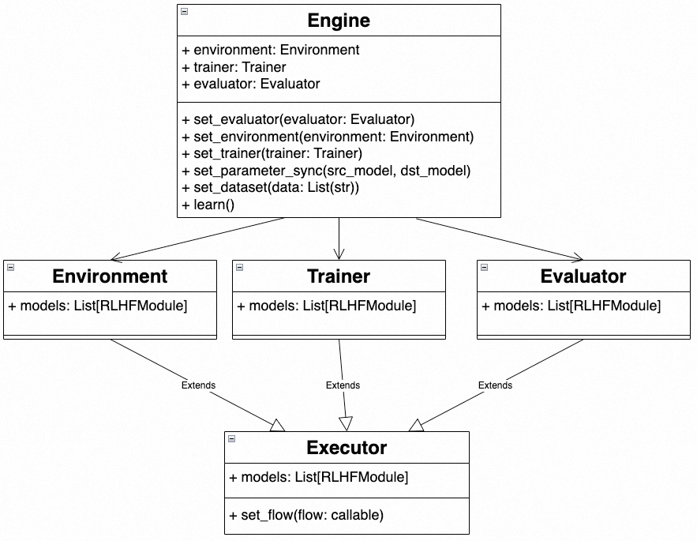

# Custom Flow
If the user wants to customize the custom inference and training model flow, they can achieve customization by using the `Engine` class.
Users can initialize the Engine by passing in environment (Environment), trainer (Trainer), and evaluator (Evaluator) components. (These components can be None)
1. Environment: N inference models calculate data for sample_per_episode and generate StreamDataset.
2. Trainer: Receives StreamDataset and trains M models.
3. Evaluator: Performs evaluation calculations on K models and an Eval dataset.

## How to customize the model flow
Pass the custom flow function into the constructor of Environment, Trainer, and Evaluator to customize the model computation flow. The following example defines the environment flow in RLHF.
The number of inputs for the model is one or more, and the number of outputs is zero or one. Any calls unrelated to the model will be ignored.
```python
policy = PolicyInference("policy")
value = ValueInference("value")
reference = PolicyReference("reference")
reward = RewardInference("reward")
def env_flow(batch):
    policy_out = policy.forward_step(batch)
    ref_out = reference.forward_step(policy_out)
    value_out = value.forward_step(policy_out)
    reward_out = reward.forward_step(policy_out, ref_out, value_out)
    return reward_out
```
## Example
### Inherit Engine to implement a custom training Engine
```python
from chatlearn import Engine, Environment, Trainer
from chatlearn import BaseModule
class CustomEngine(Engine):
    def __init__(self,
                 reference: BaseModule,
                 policy_trainer: BaseModule):
        def env_flow(batch):
            ref_out = reference.forward_step(batch)
            return ref_out
        def trainer_flow(batch):
            policy_trainer.train_step(batch)
        env = Environment(env_flow)
        trainer = Trainer(trainer_flow)
        super().__init__(env, trainer)
```
In this example, we define a CustomEngine with 2 models, where the environment has only one reference model and the trainer has only one policy_trainer model.
The following code is a simple user calling process.
```python
reference = PolicyReference("reference")
ppo_policy = PolicyTrainer("policy_trainer")
engine = CustomEngine(reference, ppo_policy) \
         .set_dataset(train_prompts)
engine.learn()
```
If you need to add an evaluation module during the training process, you can also set the evaluator.
```python
reference = PolicyReference("reference")
ppo_policy = PolicyTrainer("policy_trainer")
def eval_flow(batch):
    r0 = reference.eval_step(batch)
    return r0
evaluator = Evaluator(eval_flow).set_dataset(val_prompts)
engine = CustomEngine(reference, ppo_policy) \
         .set_evaluator(evaluator) \
         .set_dataset(train_prompts)
engine.learn()
```
### Use Engine directly to construct a custom process
In the following example, we directly construct a training process for RLHF using the Engine class.
```python
policy = PolicyInference("policy")
value = ValueInference("value")
reference = PolicyReference("reference")
reward = RewardInference("reward")
ppo_policy = PolicyTrainer("ppo_policy")
ppo_value = ValueTrainer("ppo_value")
def env_flow(batch):
    policy_out = policy.forward_step(batch)
    ref_out = reference.forward_step(policy_out)
    value_out = value.forward_step(policy_out)
    reward_out = reward.forward_step(policy_out, ref_out, value_out)
    return reward_out
def trainer_flow(batch):
    ppo_policy.train_step(batch)
    ppo_value.train_step(batch)
def eval_flow(batch):
    r0 = policy.eval_step(batch)
    r1 = reward.eval_step(r0)
    return r1
env = Environment(env_flow)
trainer = Trainer(trainer_flow)
evaluator = Evaluator(eval_flow).set_dataset(val_prompts)
engine = Engine(env, trainer, evaluator) \
         .set_parameter_sync(ppo_policy, policy) \
         .set_parameter_sync(ppo_value, value) \
         .set_dataset(train_prompts)
engine.learn()
```