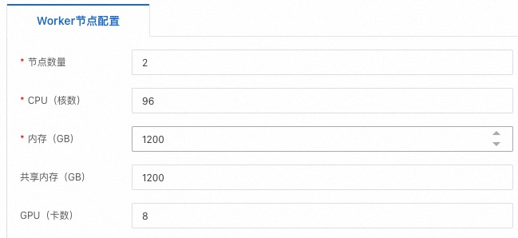

# Distributed Execution

This document will provide instructions on how to execute a distributed training task.

## PAI DLC Distributed Execution

[Aliyun PAI DLC](https://www.aliyun.com/activity/bigdata/pai-dlc) [1] can conveniently and efficiently support training for various tasks. 

The screenshots of the PAI-DLC task creation page is shown as follows.
Select the job type as `PyTorch` and paste the command into the `Execution Command` window.





For RLHF Training task, you need set the advanced setting as `customPortList=30000-30050,createSvcForAllWorkers=true`.


## Non-PAI-DLC environment

If you want to submit distributed training in a non-PAI-DLC environment,
the following environment variables need to be configured on each node before executing the script:

```bash
export MASTER_ADDR=xxx
export MASTER_PORT=xxx
export WORLD_SIZE=xxx
export GPUS_PER_NODE=8
export RANK=xx
```

# reference

1. Aliyun Machine Learning PAI-DLC：[https://www.aliyun.com/activity/bigdata/pai-dlc](https://www.aliyun.com/activity/bigdata/pai-dlc)
