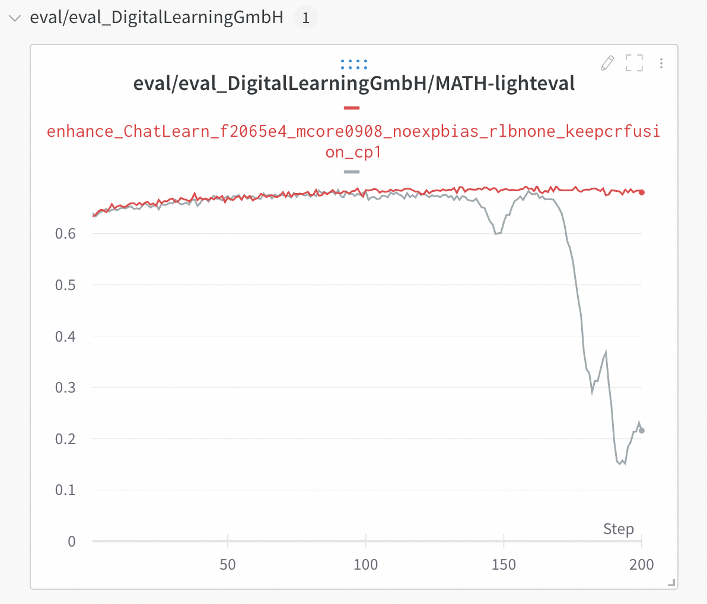
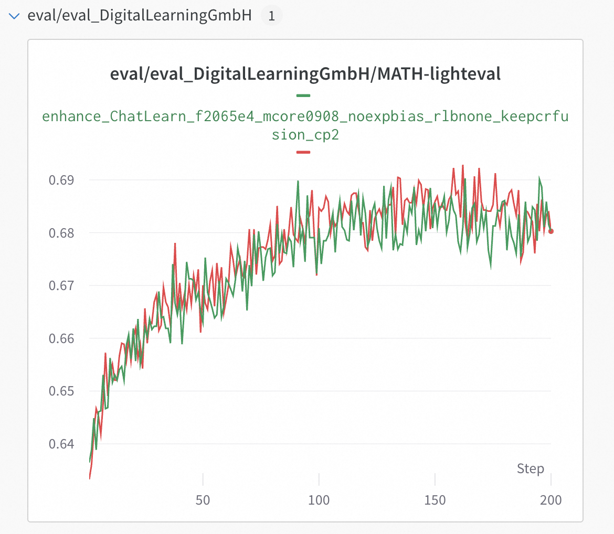
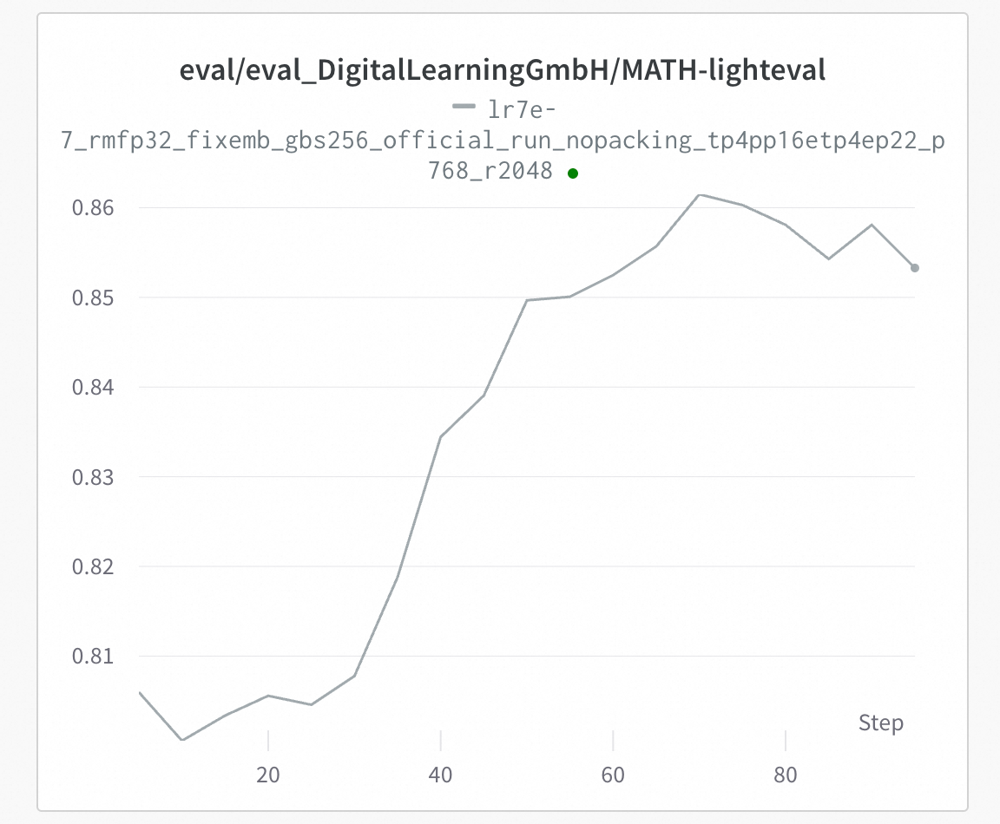

# End-to-End GRPO Training Process Based on Mcore

Quick Start Guide for GRPO Training of MLA Models (e.g., Moonlight & DeepSeek-V3) Using ChatLearn, Mcore, and vLLM Frameworks

## Development Environment Configuration
We recommend building the Docker image based on nvcr.io/nvidia/pytorch:24.12-py3 in the PAI-DSW environment
```bash
#Install dependencies for ChatLearn such as VLLM and Transformers
pip install modelscope==1.30.0 tensordict==0.10.0 torchdata==0.11.0 codetiming==1.4.0 vllm==0.8.5 transformers==4.56.2 blobfile==3.0.0 numpy==1.26.4 accelerate==1.10.0 wandb==0.19.11 datasets==3.6.0 grpcio==1.71.0 omegaconf==2.3.0  hydra-core==1.3.2 msgspec==0.19.0 mathruler==0.1.0 pylatexenc==2.10 langgraph==0.6.6 ray[default]==2.46.0 -i https://mirrors.aliyun.com/pypi/simple/ 

#Reinstall flash_attn and apex after VLLM installation (which overrides pytorch)
pip uninstall -y flash_attn && pip install https://pai-vision-data-hz.oss-cn-zhangjiakou.aliyuncs.com/csrc/flash-attention/torch2.6.0-cu12x/flash_attn-2.4.2-cp312-cp312-linux_x86_64.whl --no-cache-dir -i https://mirrors.aliyun.com/pypi/simple/ 

pip uninstall -y apex && pip install https://pai-vision-data-hz.oss-cn-zhangjiakou.aliyuncs.com/csrc/apex/torch2.6.0-cuda12x/apex-0.1-cp312-cp312-linux_x86_64.whl --no-cache-dir -i https://mirrors.aliyun.com/pypi/simple/ 

#Upgrade Transformer Engine
pip uninstall -y transformer-engine transformer-engine-cu12 transformer-engine-torch
git clone --recursive https://github.com/NVIDIA/TransformerEngine.git
cd TransformerEngine
git submodule update --init --recursive
git checkout release_v2.7
export CUDNN_PATH=/usr/local/lib/python3.12/dist-packages/nvidia/cudnn/
cp /usr/local/lib/python3.12/dist-packages/nvidia/cudnn/include/*  /usr/local/cuda/include/
python setup.py bdist_wheel  -vvv
cd dist
export NVTE_FRAMEWORK=pytorch 
pip install transformer_engine-2.7.0-cp312-cp312-linux_x86_64.whl --no-cache-dir -i https://mirrors.aliyun.com/pypi/simple/ --trusted-host mirrors.cloud.aliyuncs.com

#Upgrade CUDNN to resolve MLA model training issues
pip install -U nvidia-cudnn-cu12==9.8.0.87 -i http://mirrors.cloud.aliyuncs.com/pypi/simple --trusted-host mirrors.cloud.aliyuncs.com

#We also provide prebuild image for quick start
dsw-registry.cn-shanghai.cr.aliyuncs.com/pai-training-algorithm/chatlearn:torch2.6.0-vllm0.8.5-te2.7-ubuntu24.04-cuda12.6-py312
```
## Code Preparation

```bash
git clone https://github.com/alibaba/ChatLearn.git
git clone --recurse-submodules https://github.com/alibaba/Pai-Megatron-Patch.git
```

## Data & Model Preparation
Using[MATH-lighteval](https://www.modelscope.cn/datasets/AI-ModelScope/MATH-lighteval)dataset as an example:
```bash
cd ChatLearn
# Download dataset
mkdir -p dataset
modelscope download --dataset AI-ModelScope/MATH-lighteval --local_dir dataset/MATH-lighteval
# preprocess dataset
python chatlearn/data/data_preprocess/math_lighteval.py --input_dir dataset/MATH-lighteval --local_dir dataset/MATH-lighteval
# download model weight
modelscope download --model moonshotai/Moonlight-16B-A3B-Instruct --local_dir Moonlight-16B-A3B-Instruct
modelscope download --model deepseek-ai/DeepSeek-V3-0324 --local_dir DeepSeek-V3-0324

# Required modifications for Moonlight's config.json:
# 1. Modify "AutoModel" and "AutoModelForCausalLM" to modeling_deepseek_pai.DeepseekV3Model and modeling_deepseek_pai.DeepseekV3ForCausalLM respectively
cp ~/Pai-Megatron-Patch/examples/moonlight/modeling_deepseek_pai.py /mnt/data/ckpts/huggingface/Moonlight-16B-A3B-Instruct

# Required modifications for DeepSeek-V3's config.json:
# 1. Remove quantization_config
# 2. Set "num_nextn_predict_layers" to 0

```

## Model Conversion
Convert Moonlight and DeepSeek-V3 models from HuggingFace format to MCore format:
```bash
CHATLEARN_ROOT=$(pwd)
cd ../Pai-Megatron-Patch/toolkits/distributed_checkpoints_convertor
bash scripts/moonlight/run_2xH20.sh  \
A3B \
${CHATLEARN_ROOT}/pretrained_models/Moonlight-16B-A3B-Instruct  \
${CHATLEARN_ROOT}/pretrained_models/Moonlight-16B-A3B-Instruct-to-mcore \
false  \
true  \
bf16

#Convert DeepSeek-V3-671B to BF16 format before conversion
cd ~/Pai-Megatron-Patch/toolkits/model_checkpoints_convertor/deepseek
python fp8_cast_bf16.py --input-fp8-hf-path ${CHATLEARN_ROOT}/pretrained_models/DeepSeek-V3-0324 --output-bf16-hf-path ${CHATLEARN_ROOT}/pretrained_models/DeepSeek-V3-0324-BF16


#Execute conversion for DeepSeek-V3-671B using DLC on 4-node 32-GPU cluster
cd ../Pai-Megatron-Patch/toolkits/distributed_checkpoints_convertor
bash scripts/deepseek_v3/run_32xH20.sh \
A37B  \
${CHATLEARN_ROOT}/pretrained_models/DeepSeek-V3-0324-BF16 \
${CHATLEARN_ROOT}/pretrained_models/DeepSeek-V3-0324-BF16-to-mcore  \
false \
true \
bf16

```

## Moonlight RL Training & Stability Guidelines
Execute GRPO training for Moonlight and DeepSeek-V3:

```bash
cd ${CHATLEARN_ROOT}
bash scripts/mcore_vllm/train_mcore_vllm_moonlight_16b_grpo.sh
bash scripts/mcore_vllm/train_mcore_vllm_deepseek_v3_671b_grpo.sh
```
MoE router parameters significantly impact model logits output, especially in off-policy training scenarios. Minor changes in routing behavior may cause substantial distribution shifts. Recommended adjustments:

Reduce or disable router load balance loss coefficient to prevent policy instability
For models with router bias (e.g., DeepSeek-V3/Moonlight), decrease moe_router_bias_update_rate to avoid collapse during RL fine-tuning Modify in chatlearn/utils/megatron_utils.py:
```bash
#cfg.models.policy_trainer.megatron_model_cfg.moe_router_load_balancing_type = "seq_aux_loss"
#cfg.models.policy_trainer.megatron_model_cfg.moe_aux_loss_coeff = 0.001
cfg.models.policy_trainer.megatron_model_cfg.moe_router_load_balancing_type = "none"
cfg.models.policy_trainer.megatron_model_cfg.moe_aux_loss_coeff = 0
```

Disable moe_router_enable_expert_bias and set moe_router_bias_update_rate to 0:
```bash 
#cfg.models.policy_trainer.megatron_model_cfg.moe_router_enable_expert_bias = True
cfg.models.policy_trainer.megatron_model_cfg.moe_router_enable_expert_bias = False
#cfg.models.policy_trainer.megatron_model_cfg.moe_router_bias_update_rate =1e-3
cfg.models.policy_trainer.megatron_model_cfg.moe_router_bias_update_rate = 0.0
```

After addressing training instability issues, validation metrics continue to improve without collapse (as shown in gray curve below):
<p align="center">
  <picture>
    
  </picture>
</p>


Equivalence testing between context_parallel_size >1 and context_parallel_size=1 passes verification:
<p align="center">
  <picture>
    
  </picture>
</p>

## DeepSeek-R1 RL Training & Stability Guidelines
Validation metrics for DeepSeek-V3-671B are shown below:
<p align="center">
  <picture>
    
  </picture>
</p>


## Training Monitoring with Wandb
Refer to best practices for Wandb integration to monitor training progress.
