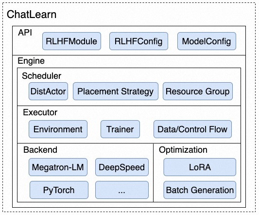

# ChatLearn

ChatLearn 是一个灵活易用，支持大规模 RLHF 的高效训练框架。

# 概述

ChatGPT 是由 OpenAI 开发的基于大型语言模型 (Large Language Model, LLM) 的聊天机器人，以其令人惊叹的对话能力而迅速火爆并被广泛采用。ChatGPT 成功背后得益于大型语言模型生成领域的新训练范式：RLHF (Reinforcement Learning from Human Feedback)，即以强化学习方式依据人类反馈优化语言模型。

不同于传统的深度学习训练，只涉及到单个模型的迭代和优化，以 RLHF 为代表的训练范式涉及到多个大模型的计算和数据交互，这对于构建构建一个易用、高效的训练系统提出了诸多的挑战。
1. **编程接口**: 如何设计一个通用且灵活的编程接口，让用户能专注于单个模型的建模，同时，又可以灵活地控制模型间的交互。
2. **分布式加速引擎**: 随着模型规模的增大，用户会选择一些分布式计算和加速的 backend，比如 Megatron-LM、DeepSpeed 等，如何结合这些加速 backend 来实现高效的多模型计算框架。
3. **并行策略**: 多个模型可能各有各的计算特点，比如仅推理的模型和训练的模型在显存和计算上的特性都不同，每个模型最佳的并行策略也可能不同。因此，框架应该允许不同的模型配置不同的并行策略以发挥整体的最佳性能。
4. **资源分配**: 如何灵活地给多个模型分配资源来实现高效的并发调度和执行。

为了解决上述问题，我们提出了一个新的 RLHF 模型训练框架 ChatLearn。ChatLearn 通过对模型计算逻辑的抽象，解耦了模型和计算 backend、分布式策略的绑定，提供灵活的资源调度机制，可以支持灵活的资源分配和并行调度策略。ChatLearn的优点总结如下:
1. **易用的编程接口**: ChatLearn提供通用的编程抽象，用户只需要封装几个函数即可完成模型构造。用户只需要专注于单模型的编程，系统负责资源调度、数据流传输、控制流传输、分布式执行等。
2. **多种分布式加速引擎**: 用户可以使用不同的计算 backend 进行模型建模，如 Megatron-LM、DeepSpeed 等。
3. **Hybrid 并行策略**: ChatLearn 支持各种并行策略组合：Data Parallel/Tensor Parallel/Sequence Parallel/Pipeline Parallel/ZeRO 及其组合。
4. **灵活的资源分配**: ChatLearn 支持灵活的资源调度机制，支持各模型的资源独占或复用，通过系统调度策略支持高效的串行/并行执行。
5. **高性能**: 相较于当前的 SOTA 系统，ChatLearn 在 7B 到 30 B 规模提升 48%-82%。同时，ChatLearn 支持更大规模的 RLHF 训练 (175B Policy + 175B Reward)。

# 技术架构

**API:** 为了支持不同的计算 backend（例如 Megatron-LM、DeepSpeed 等），ChatLearn 抽象了一个通用的编程接口 `RLHFModule`，用户通过继承`RLHFModule`，实现基础的计算函数（如 `forward_step`、`train_step` 等），即可完成对不同计算 `backend` 的封装。同时，ChatLearn 通过 yaml 文件的形式为 RLHF 训练，以及不同的模型配置不同的超参数、并行策略等，来实现灵活的模型和并行策略配置。

**Scheduler:** 随着大语言模型的训练规模的增大（如 175B 规模的模型），单机已经无法容纳这么大的模型训练，需要跨机的分布式计算。ChatLearn 提出了 `DistActor` 的抽象，来表示分布式模型。`DistActor` 建立在 Ray actor 的状态管理和 worker 间的隔离性，可以很方便地管理不同模型的参数和状态。同时，`DistActor` 解决了 Ray actor 不能跨机的限制，以支持跨机的分布式模型。通过 `DistActor`，ChatLearn 可以支持任意规模的模型推理和训练。同时，ChatLearn Scheduler 通过划分集群 Resource Group 和调度策略，实现硬件感知的亲和性调度，即优先将同一个分布式模型调度到同一节点的 GPU 资源上。ChatLearn 也支持灵活的资源分配，即支持模型间的资源复用和资源独占，在给定资源数的情况下，实现训练效率的最大化。

**Executor:** ChatLearn Executor 将 RLHF 训练流程划分为两个主要的模块，`Environment` 和 `Trainer`。`Environment` 负责推理模块模型和数据的并发执行和管理，`Trainer` 负责相应的训练模块。这两个模块负责模型数据流和控制流的管理。模型间的数据传递通过 Ray 的 object store 进行传输，模型间的参数传递通过 NCCL Collective OP 进行传输。

**Backend:** 得益于 ChatLearn 良好的编程接口抽象，用户通过简单的封装即可接入各种不同 backend 进行计算优化和算法优化。

**Optimization**: ChatLearn 也支持各种显存优化和计算加速，通过开发 LoRA，大大减少了 optimizer states 的显存开销，用于提升 batch size 来提升整体的计算效率。ChatLearn 也在持续优化 Policy 模型的 batch generation 过程，通过 input sequence 排序等方式来减少部分 padding 无效计算，提升整体的性能。

# 快速开始

请参考 [文档](https://chatlearn.readthedocs.io/zh/latest/) 快速开始.

1. [环境和代码准备](installation.md)
2. [基于 LLaMA 模型的端到端训练教程](tutorial.md)

# 支持的模型

当前 ChatLearn 框架支持任意规模的 GPT/LLaMA 模型 RLHF 训练。

| 模型类型                                                                                                                                                                         |
|:-----------------------------------------------------------------------------------------------------------------------------------------------------------------------------|
| GPT (GPT 系列各种规模的模型)                                                                                                                                                          |
| LLaMA (`lmsys/vicuna-13b-v1.3`, `decapoda-research/llama-7b-hf`, `decapoda-research/llama-13b-hf`, `decapoda-research/llama-30b-hf`, `decapoda-research/llama-65b-hf`, etc.) |
| LLaMA2 (`meta-llama/Llama-2-7b-hf`, `meta-llama/Llama-2-13b-hf`)                                                                                                             |

注：当前的性能 benchmark 均基于 GPT 系列模型。

# 性能评估

我们比较了不同参数量规模模型的 RLHF 训练吞吐量，我们采取 N+N 的模型配置，即 Policy 模型和 Reward 模型采用相同大小的参数量。测试基于 A800-80GB GPU 进行，单节点配置 8 卡 GPU，节点间采用 800Gb RDMA 互联。我们和 DeepSpeed-Chat 对比了从 7B 到 66B 的模型配置，关闭/开启 LoRA 后的性能对比，ChatLearn 在不同规模有 48% 到 82% 的加速，在更大的规模下，在 30B+30B，32GPUs 的配置下，不开启 LoRA 的情况下，DeepSpeed-chat 出现 OOM，在 66B+66B，32GPUs 的配置下，DeepSpeed-Chat 无论是否开启 LoRA 均会出现 OOM，ChatLearn 在相同机器规模下，可以支持更大的模型配置训练。在 seq_len=2048 时，DeepSpeed-Chat 出现了 kernel error。

同时，我们评估了在更大规模以及不同 sequence length 配置下的性能。下图分别为 66B+66B，175B+175B 的 RLHF 训练性能。

# Roadmap

ChatLearn 接下来会支持以下特性：
- [ ] 支持更多的模型；
- [ ] 接入 DeepSpeed 作为训练 backend；
- [ ] 自动并行策略调优；
- [ ] 支持 vLLM 等高效推理引擎；
- [ ] 支持更多的 RL 算法；

  
我们欢迎社区小伙伴参与进来合作开发。

# Reference

1. Megatron-LM: https://github.com/NVIDIA/Megatron-LM
2. DeepSpeed-Chat: https://github.com/microsoft/DeepSpeedExamples/tree/master/applications/DeepSpeed-Chat
