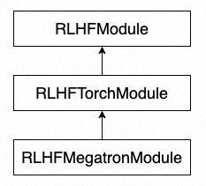

# 编程接口

本章节将介绍 ChatLearn 的编程接口，我们会从主文件开始介绍如何构造 `RLHFEngine`，然后再介绍如何编写模型。

## 训练主文件
以下为用户的训练主文件的范例。

1. 调用`chatlearn.init()`初始化 rlhf 的运行环境。
2. 定义训练所需的模型。其中每个模型需要定义一个唯一的`model_name`。在配置模型参数的时候，不同模型的配置通过`model_name`来区分。详见[训练配置文件](config_yaml)。
3. 定义 engine [RLHFEngine](api/engine.rst)。
4. 设置训练数据集。
5. 调用`engine.learn`开启 RLHF 的训练。 


```python
from models import PolicyInference
from models import PolicyReference
from models import PolicyTrainer
from models import RewardInference
from models import ValueInference
from models import ValueTrainer

import chatlearn
from chatlearn import RLHFEngine

# init
chatlearn.init()

# define models
policy_model = PolicyInference("policy")
reference_model = PolicyReference("reference")
reward_model = RewardInference("reward")
value_model = ValueInference("value")
ppo_policy_model = PolicyTrainer("ppo_policy")
ppo_value_model = ValueTrainer("ppo_value")

# define engine
engine = RLHFEngine(policy_model,
                    reference_model,
                    reward_model,
                    value_model,
                    ppo_policy_model,
                    ppo_value_model)

# set dataset
train_prompts = ["test"] * 4096
engine.set_dataset(train_prompts)

# start rlhf training
engine.learn()
```


## 模型定义



用户的模型需要继承`RLHFModule`或其子类，`RLHFTorchModule`为通用的 Torch 模型的封装，`RLHFMegatronModule`为 Megatron 模型的封装。如果用户的 RLHF 建模是基于 Megatron-LM，可以直接继承`RLHFMegatronModule`完成模型的建模。以继承`RLHFMegatronModule`为例，下述两段代码展现了 inference 模型的建模和 training 模型建模的例子：
1. 对于 inference 模型，用户需要实现`setup`和`forward_step`方法。在`setup`中，完成模型的定义，参数初始化，全局参数定义等工作。在`forward_step`中，实现模型一次前向所需的逻辑。
2. 对于 training 模型，用户需要实现`setup`和`train_step`方法。在`train_step`中，实现训练一个 step 所需的逻辑。
3. 除此之外，PolicyInference 模型需要实现`build_dataset`方法，完成 prompt 数据集的构建。

更多 API 信息参考[RLHF Module API](api/module.rst).

```python
from chatlearn import RLHFMegatronModule

class PolicyInference(RLHFMegatronModule):

    def __init__(self, name):
        """
        Args:
            name: model name
        """


    def setup(self):
        """
        1. define model, self.model = xxx
        2. init global variables, etc.
        3. for training model, define optimizer, self.optimizer = xxx
        4. init model parameters
        """
        pass
    

    def forward_step(self, data, iteration=0):
        """
        Perform forward step for one batch
        Args:
            data: one batch for forward_step, type is dict
            iteration: iteration id for current step
        Returns:
            k/v dict
        """
        pass


    def build_dataset(self, train_prompts):
        """
        Build prompt dataset. The implementation of build_dataset is exclusive to PolicyInference, whereas other models are not required to adopt it.

        Args:
            train_prompts: prompts provided by RLHFEngine.set_dataset(train_prompts)
        Returns:
            torch.utils.data.Dataset with user-defined collate_fn (see `Dataset`)
        """
        pass
```

```python
from chatlearn import RLHFMegatronModule

class PolicyTrainer(RLHFMegatronModule):


    def setup(self):
        """
        1. define model, self.model = xxx
        2. init global variables, etc.
        3. for training model, define optimizer, self.optimizer = xxx
        4. init model parameters
        """
        pass


    def train_step(self, data, train_info):
        """
        Perform train_step for one batch, including a list of micro-batches
        Args:
            data: one global batch for train_step, type is a list of dict, each dict is a micro-batch
            train_info: includes training information, e.g., "iteration"
        """
        pass
```
## Dataset
用户使用的 Dataset 需要继承 `torch.utils.data.Dataset` 并指定 `collate_fn` 方法。要继承`torch.utils.data.Dataset`，用户需要根据需求重写`__init__`、`__getitem__`和`__len__`方法（see [Creating a Custom Dataset for Your Files](https://pytorch.org/tutorials/beginner/basics/data_tutorial.html#creating-a-custom-dataset-for-your-files)）。`collate_fn`方法允许用户自定义数据整理（see [collate-fn](https://pytorch.org/docs/stable/data.html#dataloader-collate-fn)）。如果用户不需要自定义数据整理，则需要在 `__init__` 方法中设置 `self.collate_fn = None`。

```bash
class PromptDataset(Dataset):
    """
    A custom dataset to construct batched prompts.
    """
    def __init__(self, data):
        self.data = data

    def __len__(self):
        return len(self.data)

    def __getitem__(self, idx):
        return {"query": self.data[idx]}

    def collate_fn(self, samples):
        batched_data = {}
        for sample_key, sample_value in samples.items():
            batched_data[sample_key] = torch.stack(sample_value)
        return batched_data
```
