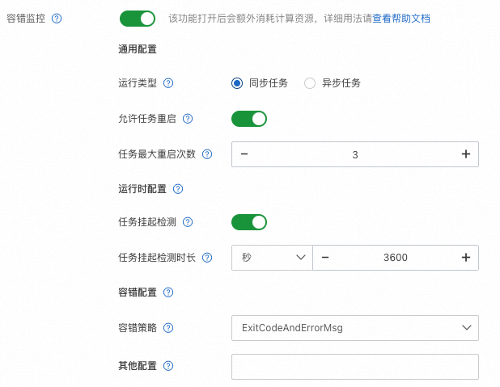

# 续跑和容错

Alignment 任务涉及到多模型的计算和交互，随着模型规模的增大和计算资源的增加，由于依赖的软件栈和硬件环境都有可能出现偶发异常，会导致任务停止运行。
为了保障被中断的任务可以恢复状态进行自动续跑，ChatLearn提供了续跑的功能，结合 PAI-DLC 的 AIMaster，可以实现自动错误检测和续跑功能。

## 配置 ChatLearn 续跑

任务的续跑需要考虑以下几点：
1. 数据进度的记录和恢复； 对于数据状态的记录，用户需要在训练配置主文件如 `rlhf.yaml` 中配置 `data_checkpoint_path`。
如果 `data_checkpoint_path` 不为空，则 ChatLearn 会记录当前的数据进度，并在每次 `save_checkpoint` 的同时存储 data checkpoint。
2. 训练状态比如 episode、iteration 等信息的恢复；当用户配置了 `data_checkpoint_path`，同时文件夹中存在对应的 data checkpoint，ChatLearn 会自动恢复训练状态到当前最新的checkpoint状态。
并将模型的 `resume_training` 变量设为 `True` 。
3. checkpoint的加载；当 `resume_training==True`， 对于 RLHF 中的几个模型，`reference` 和 `reward` 加载的 checkpoint 保持不变。
`ppo_policy` 和 `ppo_value` 需要加载训练中存储的checkpoint，而不是原始初始化的checkpoint。 因此需要在 `setup` 阶段做特殊处理。

```python
if self.resume_training:
    self.args.load = get_args().save
    self.args.load_iteration = -1
    self.args.no_load_optim = False
    self.args.no_load_rng = False
    self.args.no_load_args = False
    self.args.no_load_scheduler = False
    self.args.finetune = False
```

更多详情可以参考 `examples/megatron/scripts/train_rlhf_llama.sh` 。

如果用户在程序中配置了 `data_checkpoint_path` ，但是不想打开续跑功能，则也可以通过配置 `enable_resume_training: False` 来关闭此功能。

## 和 DLC AIMaster 结合实现容错和自动续跑

DLC提供了基于AIMaster的容错监控功能。AIMaster是一个任务级别的组件，当任务开启AIMaster的容错监控功能后，
会拉起一个AIMaster实例和任务其他实例一起运行，起到任务监控、容错判断、资源控制的作用。

用户可以通过结合 AIMaster 的容错功能和 ChatLearn 的续跑功能来实现训练任务的自动续跑。

以下为容错监控的配置示例，在这个配置中打开了 hang 检测和错误检测，
当hang 超过 1 个小时或者当 AIMaster 检测到错误，会将任务自动重启，最大重启次数为3次。



更多的容错配置请参考 DLC [容错文档](https://help.aliyun.com/zh/pai/user-guide/fault-tolerance-monitoring-based-on-aimaster?spm=a2c4g.11186623.0.0.12011976WAncyo) 。


