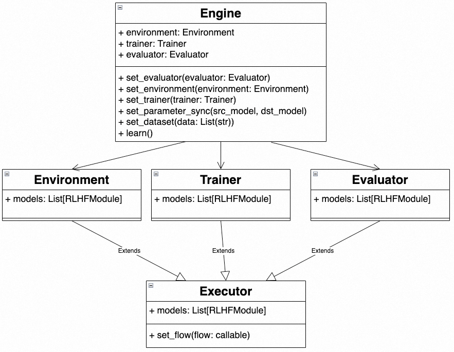

# 自定义流程

如果用户想定制自定义的推理和训练模型流程，可以通过使用 `Engine` 类来实现自定义。
用户可以传入 environment (Environment), trainer (Trainer) 和 evaluator (Evaluator) 来初始化 Engine。(这些组件可以为None)
1. Environment: N 个推理模型计算 sample_per_episode的数据，生成 StreamDataset。
2. Trainer：接收StreamDataset，进行 M 个模型的训练。
3. Evaluator: 对K个模型和一个 Eval 数据集进行 evaluation 计算。



## 如何自定义模型流程

将自定义 flow 函数传入 Environment, Trainer 和 Evaluator 的构造方法，来定制模型的计算 flow。以下例子定义了 RLHF 中的environment flow。
模型的输入个数为1个或多个，输出个数为0个或1个。任何和模型无关的调用将会被忽略。

```python
policy = PolicyInference("policy")
value = ValueInference("value")
reference = PolicyReference("reference")
reward = RewardInference("reward")

def env_flow(batch):
    policy_out = policy.forward_step(batch)
    ref_out = reference.forward_step(policy_out)
    value_out = value.forward_step(policy_out)
    reward_out = reward.forward_step(policy_out, ref_out, value_out)
    return reward_out
```

## 例子

### 继承 Engine 实现自定义的训练 Engine

```python
from chatlearn import Engine, Environment, Trainer
from chatlearn import BaseModule


class CustomEngine(Engine):

    def __init__(self,
                 reference: BaseModule,
                 policy_trainer: BaseModule):
        def env_flow(batch):
            ref_out = reference.forward_step(batch)
            return ref_out

        def trainer_flow(batch):
            policy_trainer.train_step(batch)

        env = Environment(env_flow)
        trainer = Trainer(trainer_flow)
        super().__init__(env, trainer)
```
在这个例子中，我们定义了2个模型的 CustomEngine，其中 environment 只有一个 reference 模型，trainer只有一个policy_trainer 模型。
以下代码为简单的用户调用流程。

```python
reference = PolicyReference("reference")
ppo_policy = PolicyTrainer("policy_trainer")

engine = CustomEngine(reference, ppo_policy) \
         .set_dataset(train_prompts)
engine.learn()
```

如果您需要在训练过程中增加evaluate模块，也可以设定evaluator。

```python
reference = PolicyReference("reference")
ppo_policy = PolicyTrainer("policy_trainer")
def eval_flow(batch):
    r0 = reference.eval_step(batch)
    return r0
evaluator = Evaluator(eval_flow).set_dataset(val_prompts)
engine = CustomEngine(reference, ppo_policy) \
         .set_evaluator(evaluator) \
         .set_dataset(train_prompts)
engine.learn()
```

### 直接使用 Engine 来构造自定义流程

在以下例子中，我们直接通过使用 Engine 类来构造一个 RLHF 的训练流程。

```python
policy = PolicyInference("policy")
value = ValueInference("value")
reference = PolicyReference("reference")
reward = RewardInference("reward")
ppo_policy = PolicyTrainer("ppo_policy")
ppo_value = ValueTrainer("ppo_value")

def env_flow(batch):
    policy_out = policy.forward_step(batch)
    ref_out = reference.forward_step(policy_out)
    value_out = value.forward_step(policy_out)
    reward_out = reward.forward_step(policy_out, ref_out, value_out)
    return reward_out

def trainer_flow(batch):
    ppo_policy.train_step(batch)
    ppo_value.train_step(batch)

def eval_flow(batch):
    r0 = policy.eval_step(batch)
    r1 = reward.eval_step(r0)
    return r1

env = Environment(env_flow)

trainer = Trainer(trainer_flow)

evaluator = Evaluator(eval_flow).set_dataset(val_prompts)

engine = Engine(env, trainer, evaluator) \
         .set_parameter_sync(ppo_policy, policy) \
         .set_parameter_sync(ppo_value, value) \
         .set_dataset(train_prompts)
engine.learn()
```
