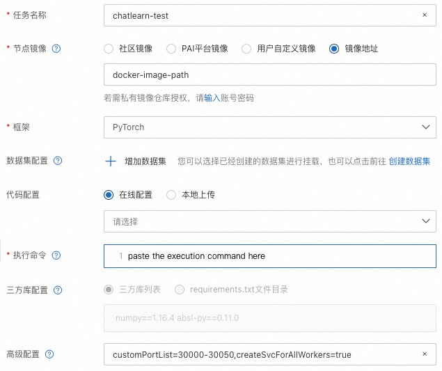
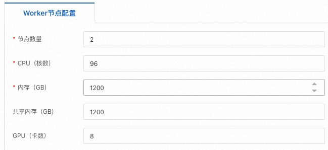

# 分布式执行

本文档将介绍如何执行一个分布式训练任务。

## PAI DLC 分布式执行

[阿里云 PAI DLC](https://www.aliyun.com/activity/bigdata/pai-dlc) [1]可以非常便捷高效地支持各种任务的训练。

以下为 PAI-DLC 创建任务的页面截图，选择作业类型为 `PyTorch`, 同时将上述命令修改后粘贴到`执行命令`窗口中, 设置节点镜像为 ChatLearn 编译后的镜像地址。在这个例子中，我们申请了2个节点，每个节点配置 8 卡 GPU。






## 其他环境分布式执行

如果您需要在非 PAI DLC 环境执行分布式任务，您需要配置以下环境变量。

```bash
export MASTER_ADDR=xxx
export MASTER_PORT=xxx
export WORLD_SIZE=xxx
export GPUS_PER_NODE=8
export RANK=xx
```

## reference

1. 阿里云机器学习 PAI-DLC：[https://www.aliyun.com/activity/bigdata/pai-dlc](https://www.aliyun.com/activity/bigdata/pai-dlc)
