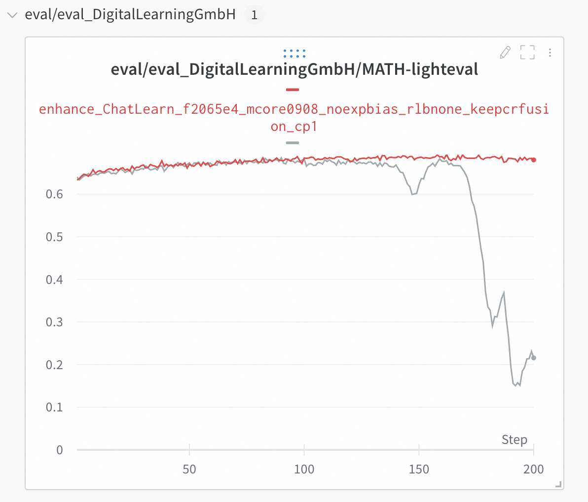
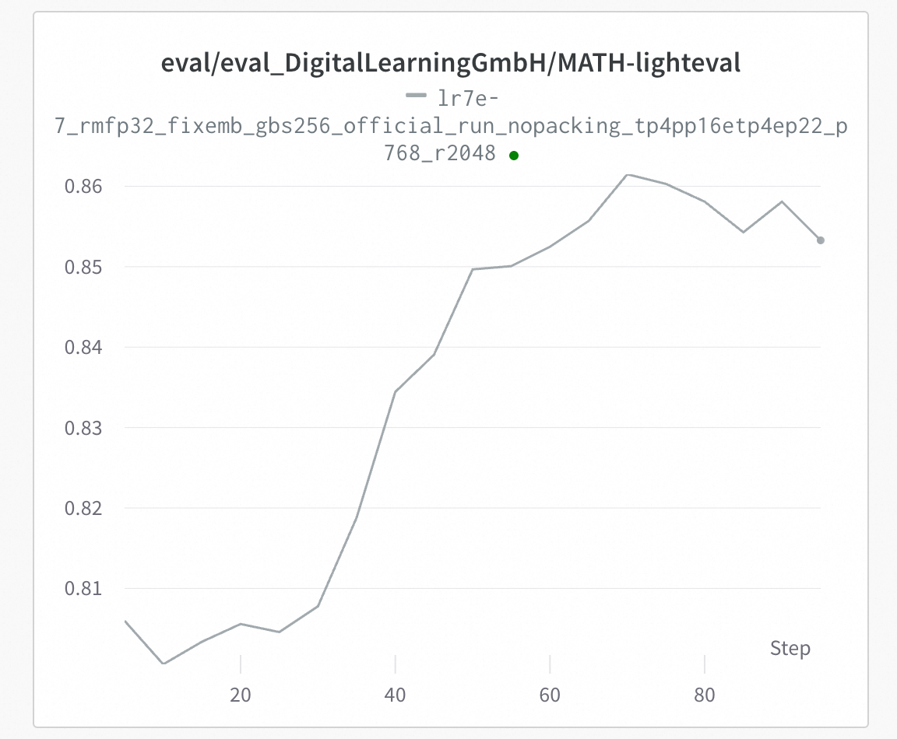

# 基于 Mcore 的端到端GRPO训练流程

本文档提供使用 ChatLearn、Mcore 和 vLLM 框架来对MLA模型比如Moonlight&DeepSeek-V3进行GRPO训练的快速开始指南。

## 开发环境配置
建议在PAI平台DSW环境中基于nvcr.io/nvidia/pytorch:24.12-py3来构建镜像。
```bash
#安装VLLM, Transformers等Chatlearn的依赖包
pip install modelscope==1.30.0 tensordict==0.10.0 torchdata==0.11.0 codetiming==1.4.0 vllm==0.8.5 transformers==4.56.2 blobfile==3.0.0 numpy==1.26.4 accelerate==1.10.0 wandb==0.19.11 datasets==3.6.0 grpcio==1.71.0 omegaconf==2.3.0  hydra-core==1.3.2 msgspec==0.19.0 mathruler==0.1.0 pylatexenc==2.10 langgraph==0.6.6 ray[default]==2.46.0 -i https://mirrors.aliyun.com/pypi/simple/ 

#由于安装VLLM会重新安装pytorch，因此需要重新安装flash attention以及apex
pip uninstall -y flash_attn && pip install https://pai-vision-data-hz.oss-cn-zhangjiakou.aliyuncs.com/csrc/flash-attention/torch2.6.0-cu12x/flash_attn-2.4.2-cp312-cp312-linux_x86_64.whl --no-cache-dir -i https://mirrors.aliyun.com/pypi/simple/ 

pip uninstall -y apex && pip install https://pai-vision-data-hz.oss-cn-zhangjiakou.aliyuncs.com/csrc/apex/torch2.6.0-cuda12x/apex-0.1-cp312-cp312-linux_x86_64.whl --no-cache-dir -i https://mirrors.aliyun.com/pypi/simple/ 

#升级Transformer Engine
pip uninstall -y transformer-engine transformer-engine-cu12 transformer-engine-torch
git clone --recursive https://github.com/NVIDIA/TransformerEngine.git
cd TransformerEngine
git submodule update --init --recursive
git checkout release_v2.7
export CUDNN_PATH=/usr/local/lib/python3.12/dist-packages/nvidia/cudnn/
cp /usr/local/lib/python3.12/dist-packages/nvidia/cudnn/include/*  /usr/local/cuda/include/
python setup.py bdist_wheel  -vvv
cd dist
export NVTE_FRAMEWORK=pytorch 
pip install transformer_engine-2.7.0-cp312-cp312-linux_x86_64.whl --no-cache-dir -i https://mirrors.aliyun.com/pypi/simple/ --trusted-host mirrors.cloud.aliyuncs.com

#升级CUDNN，用以解决MLA模型训练时出现的问题
pip install -U nvidia-cudnn-cu12==9.8.0.87 -i http://mirrors.cloud.aliyuncs.com/pypi/simple --trusted-host mirrors.cloud.aliyuncs.com

#我们也提供了预先构建好的镜像协助您快速测试
dsw-registry.cn-shanghai.cr.aliyuncs.com/pai-training-algorithm/chatlearn:torch2.6.0-vllm0.8.5-te2.7-ubuntu24.04-cuda12.6-py312
```
## 代码准备

```bash
git clone https://github.com/alibaba/ChatLearn.git
git clone --recurse-submodules https://github.com/alibaba/Pai-Megatron-Patch.git
```

## 数据&模型准备
以[MATH-lighteval](https://www.modelscope.cn/datasets/AI-ModelScope/MATH-lighteval)数据集作为示例.
```bash
cd ChatLearn
# 下载数据集
mkdir -p dataset
modelscope download --dataset AI-ModelScope/MATH-lighteval --local_dir dataset/MATH-lighteval
# preprocess dataset
python chatlearn/data/data_preprocess/math_lighteval.py --input_dir dataset/MATH-lighteval --local_dir dataset/MATH-lighteval
# download model weight
modelscope download --model moonshotai/Moonlight-16B-A3B-Instruct --local_dir Moonlight-16B-A3B-Instruct
modelscope download --model deepseek-ai/DeepSeek-V3-0324 --local_dir DeepSeek-V3-0324

#Moonlight模型的config.json需要做如下的改进: 将"AutoModel"和"AutoModelForCausalLM"的值分别修改为modeling_deepseek_pai.DeepseekV3Model，modeling_deepseek_pai.DeepseekV3ForCausalLM
cp ~/Pai-Megatron-Patch/examples/moonlight/modeling_deepseek_pai.py /mnt/data/ckpts/huggingface/Moonlight-16B-A3B-Instruct

#DeepSeek-V3模型的config.json需要做如下的改进: 
1. 删除DeepSeek-V3的config.json中的quantization_config相关配置
2. 将"num_nextn_predict_layers"修改为0


```

## 模型转换
使用下述脚本将Moonlight和DeepSeek-V3的Huggingface格式的模型转换到MCore格式
```bash
CHATLEARN_ROOT=$(pwd)
cd ../Pai-Megatron-Patch/toolkits/distributed_checkpoints_convertor
bash scripts/moonlight/run_2xH20.sh  \
A3B \
${CHATLEARN_ROOT}/pretrained_models/Moonlight-16B-A3B-Instruct  \
${CHATLEARN_ROOT}/pretrained_models/Moonlight-16B-A3B-Instruct-to-mcore \
false  \
true  \
bf16

#在对DeepSeek-V3-671B执行转换前先将其格式转换成BF16
cd ~/Pai-Megatron-Patch/toolkits/model_checkpoints_convertor/deepseek
python fp8_cast_bf16.py --input-fp8-hf-path ${CHATLEARN_ROOT}/pretrained_models/DeepSeek-V3-0324 --output-bf16-hf-path ${CHATLEARN_ROOT}/pretrained_models/DeepSeek-V3-0324-BF16


#使用DLC在4机32卡上对DeepSeek-V3-671B执行转换
cd ../Pai-Megatron-Patch/toolkits/distributed_checkpoints_convertor
bash scripts/deepseek_v3/run_32xH20.sh \
A37B  \
${CHATLEARN_ROOT}/pretrained_models/DeepSeek-V3-0324-BF16 \
${CHATLEARN_ROOT}/pretrained_models/DeepSeek-V3-0324-BF16-to-mcore  \
false \
true \
bf16

```

## Moonlight强化学习训练以及训练稳定性指引
运行以下命令可以对Moonlight和DeepSeek-V3进行GRPO训练：

```bash
cd ${CHATLEARN_ROOT}
bash scripts/mcore_vllm/train_mcore_vllm_moonlight_16b_grpo.sh
bash scripts/mcore_vllm/train_mcore_vllm_deepseek_v3_671b_grpo.sh
```

MoE 路由器的参数可能显著影响模型的 logits 输出，尤其是在离线策略（off-policy）训练场景下。路由行为的微小变化可能引发较大的分布偏移。建议进行以下调整：
   + 降低路由器负载均衡损失（router load balance loss）的权重系数，或直接关闭该损失项，以防其干扰策略稳定性。
   + 如果模型中启用了router bias（如 `DeepSeek-V3` 或 `Moonlight`），应降低 `moe_router_bias_update_rate`，避免在 RL 微调阶段因路由更新而导致的崩溃。

具体来讲，在chatlearn/utils/megatron_utils.py中调整降低路由器负载均衡损失（router load balance loss）的权重系数，或直接关闭该损失项，以防其干扰策略稳定性。MoE模型中控制负载均衡相关的参数 `moe_router_load_balancing_type` 和 `moe_aux_loss_coeff` 可能对模型训练稳定性有较大影响。
```bash
#cfg.models.policy_trainer.megatron_model_cfg.moe_router_load_balancing_type = "seq_aux_loss"
#cfg.models.policy_trainer.megatron_model_cfg.moe_aux_loss_coeff = 0.001
cfg.models.policy_trainer.megatron_model_cfg.moe_router_load_balancing_type = "none"
cfg.models.policy_trainer.megatron_model_cfg.moe_aux_loss_coeff = 0
```

将chatlearn/utils/megatron_utils.py中的`moe_router_enable_expert_bias`关闭以及`moe_router_bias_update_rate`从1e-3修改为0，避免在RL微调阶段因路由更新而导致的崩溃。
```bash 
#cfg.models.policy_trainer.megatron_model_cfg.moe_router_enable_expert_bias = True
cfg.models.policy_trainer.megatron_model_cfg.moe_router_enable_expert_bias = False
#cfg.models.policy_trainer.megatron_model_cfg.moe_router_bias_update_rate =1e-3
cfg.models.policy_trainer.megatron_model_cfg.moe_router_bias_update_rate = 0.0
```

在解决了一些训练不稳定的问题后，验证集升的评估指标仍然有提升，而不会出现如下图灰色曲线所示的坍塌的现象。
<p align="center">
  <picture>
    
  </picture>
</p>

另外context parallel size 大于 1和context parallel size 等于1的等价性测试也通过，如下图所示
<p align="center">
  <picture>
    
  </picture>
</p>

## DeepSeek-R1强化学习训练以及训练稳定性指引
与此同时，我们也测试了DeepSeek-V3-671B在验证集上的评估指标情况，如下图所示：
<p align="center">
  <picture>
    
  </picture>
</p>

## 使用 Wandb 监控
如需使用 Wandb 记录训练过程，请参考其他最佳实践进行修改。
